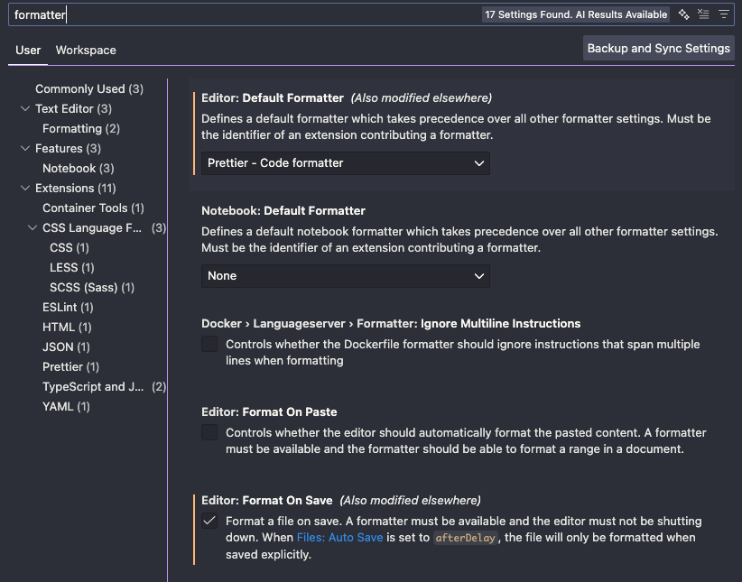

# Definindo os Linters

Para o Linter, vamos usar o ``Prettier``. Ele pode, e deve, ser instalado como extensão do VSCode, mas é melhor instalarmos ele também como uma dependência de dev do projeto, assim todo mundo da equipe pode usar o mesmo linter.

Primeiramente, vamos criar um arquivo ``.editorconfig``, que vai fazer o IDE formatar algumas coisas pra gente por padrão, como o tamanho da identação. Esse arquivo não altera nada do que já foi escrito, mas passa a valer depois de criado.


```bash title="/.editorconfig"
root = true
[*]
indent_style = space
indent_size = 2
```

## Instalando o Prettier
Agora sim vamos instalar o Prettier com a flag ``--save-dev``:
```bash
npm install --save-dev prettier
```

E vamos adicionar os atalhos no ``package.json``.

```javascript title="/package.json"
  "scripts": {
    "lint:check": "prettier --check .",
    "lint:fix": "prettier --write .",
},
```

No VSCode, instale a extensão do Prettier, e ative ele como Default Formatter e habilite o Format On Save:


Mas vamos criar um arquivo ``.prettierignore`` para ele ignorar algumas pastas, como a node_modules e .next:

```bash title="/.prettierignore"
.next
node_modules
```

Agora para rodar, basta fazer um lint:check (para verificar os erros de Linting) e "lint:fix" (para ele tentar corrigir automaticamente os erros)