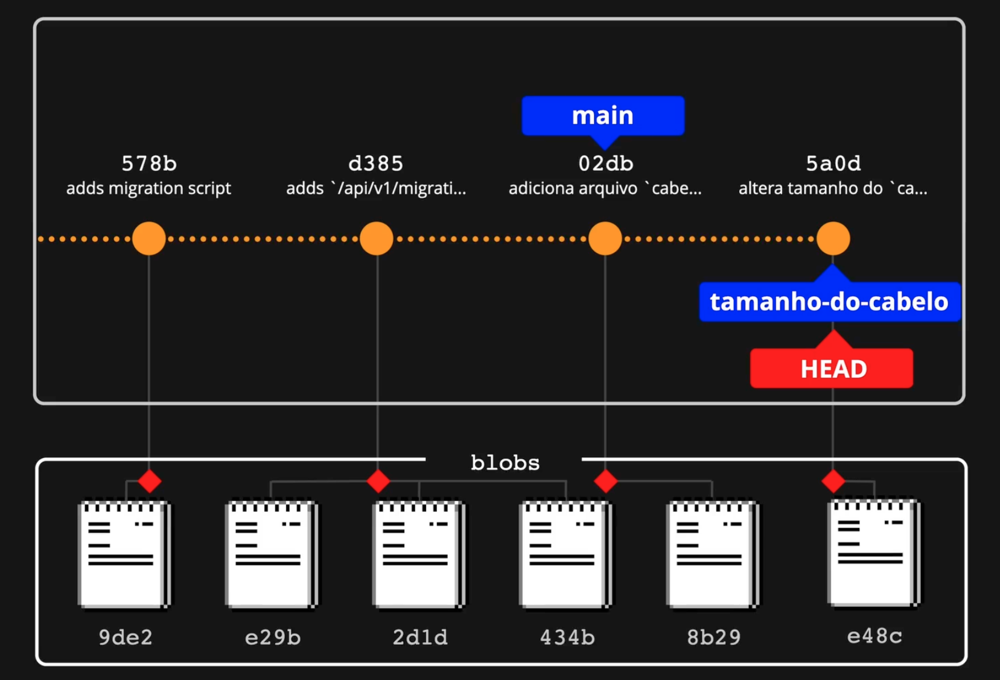
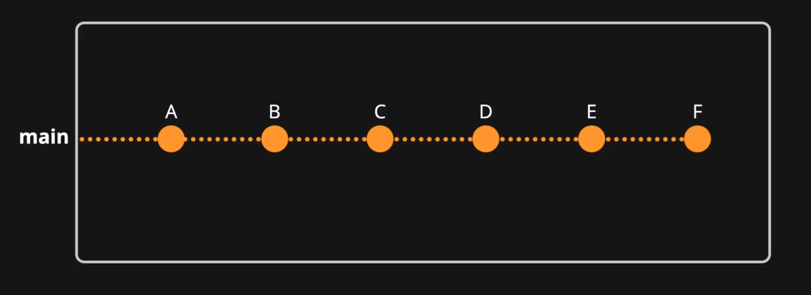
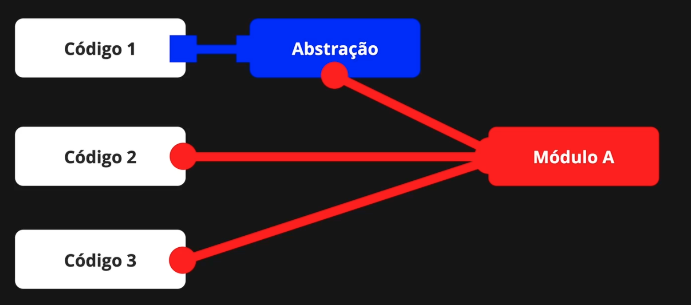
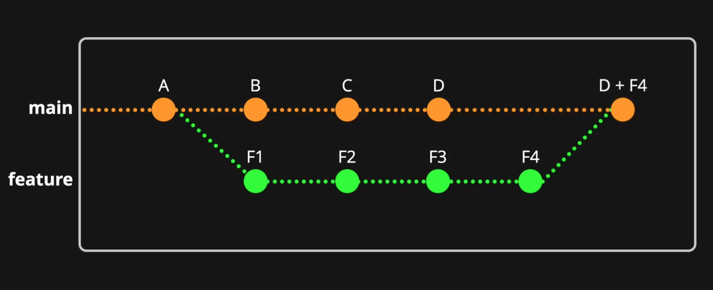
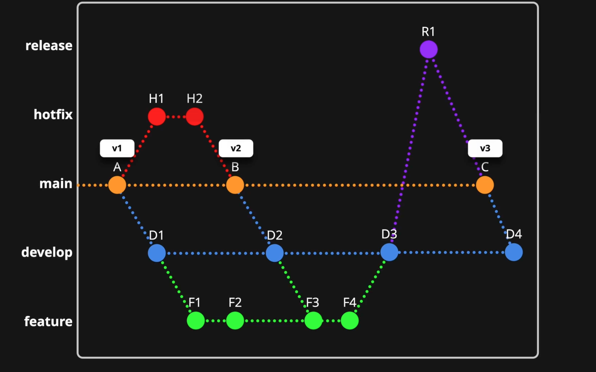
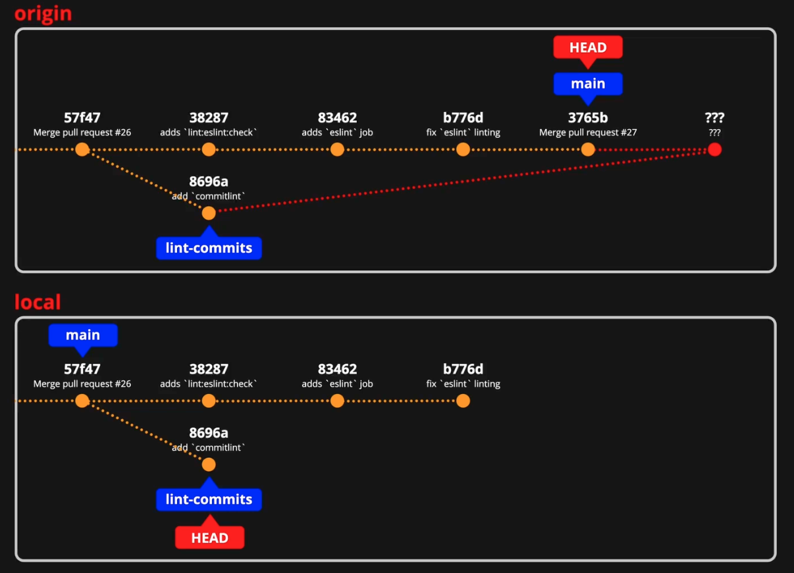

# Git Overview
Ao contrário de sistemas antigos como o CVS, que utilizavam _Delta Encoding_ (mantendo o histórico de alterações com base nos **diffs**), o Git trabalha com "fotos" completas do repositório.

Quando fazemos um commit, o Git tira uma “foto” do estado atual do projeto. Para cada arquivo, ele calcula um identificador único com base no conteúdo e salva esse conteúdo na pasta `.git` como um objeto chamado Blob (Binary Large Object). Ao criar um novo commit, o Git verifica quais arquivos foram alterados:

- Arquivos modificados geram novos blobs com o conteúdo atualizado, mas os blobs antigos continuam armazenados.
- Arquivos que não mudaram não geram novos blobs; o commit apenas aponta para os blobs já existentes.

Assim, um commit é basicamente um conjunto de referências para blobs (e para a árvore que organiza esses blobs). Por isso o Git alterna rapidamente entre diferentes “fotos” do repositório. Para visualizar essas "fotos" (commits), usamos o comando `git log`:

```bash title="git log"
commit 4cd6741adf5b1033ea47e8d622b0262113366130 (HEAD -> main, origin/main, origin/fix-migrations-endpoint, fix-migrations-endpoint)
Author: Bruno Nonogaki <brunono@gmail.com>
Date:   Mon Nov 17 17:56:14 2025 -0300

    Implementing same fix as in class

commit 4531c8a9ff6e5d977cd5d8b5429ebba435ecbc17
Author: Bruno Nonogaki <brunono@gmail.com>
Date:   Mon Nov 17 17:36:39 2025 -0300

    adding try and catch

commit d06fde4f85af929674503b9261b8eecdb5e4214e
Author: Bruno Nonogaki <brunono@gmail.com>
Date:   Sun Nov 16 22:07:44 2025 -0300

    Change header for preview test

commit ecdfac3dcd6d753bdc8716eaae579fc6e8d5e315
Author: Bruno Nonogaki <brunono@gmail.com>
Date:   Wed Nov 12 21:38:44 2025 -0300

    adds api/v1/migrations endpoint
...
```

Para uma visão mais detalhada do que foi alterado em cada commit, use `git log --stat`:

```bash
commit 4cd6741adf5b1033ea47e8d622b0262113366130 (HEAD -> main, origin/main, origin/fix-migrations-endpoint, fix-migrations-endpoint)
Author: Bruno Nonogaki <brunono@gmail.com>
Date:   Mon Nov 17 17:56:14 2025 -0300

    Implementing same fix as in class

 pages/api/v1/migrations.js | 35 ++++++++++++++++++++---------------
 1 file changed, 20 insertions(+), 15 deletions(-)

```

Para uma visão resumida, use `git log --oneline`:

```bash
4cd6741 (HEAD -> main, origin/main, origin/fix-migrations-endpoint, fix-migrations-endpoint) Implementing same fix as in class
4531c8a adding try and catch
d06fde4 Change header for preview test
ecdfac3d adds api/v1/migrations endpoint
b6de408 Add migratios scripts
247d618 Add SSL in Database connection
93101ad Add throw error in database.js
6a584a3 finishing  status route
08c5c7d deploy script
f151262 Adicionando integração com banco de dados
708fdc9 add  endpoint
47cd4f5 Merge branch 'main' of https://github.com/brunononogaki/meubonsai-app-v2
252f63b Setting up dev environment
24a928e first commit
```

## Os quatro estágios do arquivo

No Git, os arquivos podem estar em quatro estágios:

- **Untracked**: Arquivo que não está sob controle do Git (para o Git, esse arquivo nem existe).
- **Modified**: Arquivo já conhecido pelo Git, que foi alterado.
- **Staged**: Arquivos alterados que estão prontos para serem “fotografados”.
- **Committed**: Arquivos já “fotografados”.

Para acompanhar o estado dos arquivos, usamos o comando `git status`:

```bash
On branch main
Your branch is up to date with 'origin/main'.

Changes not staged for commit:
  (use "git add <file>..." to update what will be committed)
  (use "git restore <file>..." to discard changes in working directory)
        modified:   mkdocs.yml

Untracked files:
  (use "git add <file>..." to include in what will be committed)
        docs/setup_ambiente/04_Git_Overview.md
```

- Para incluir arquivos modificados na área de stage, use `git add`.
- Para salvar as alterações, faça o commit com `git commit -m "descrição do commit"`.

Depois do commit, teremos uma nova “foto” desses arquivos, que pode ser visualizada com `git log`:

```bash
commit f0203262c216b5fd4e311a22c2eac311224ea53a (HEAD -> main)
Author: Bruno Nonogaki <brunono@gmail.com>
Date:   Tue Nov 18 14:54:23 2025 -0300

    Adding git documentation

commit 9235c2ae3e23db0ae014c7090b4acc1757fbfb3b (origin/main)
Author: Bruno Nonogaki <brunono@gmail.com>
Date:   Mon Nov 17 18:13:02 2025 -0300

    Criando a sessão de banco de dados de prod e staging
```

No exemplo acima, criamos um novo commit chamado "Adding git documentation".

## git commit --amend

Se você quiser incluir uma nova alteração no último commit, sem criar outro (evitando “sujar” o histórico), use:

```bash
git commit --amend
```

Antes de rodar esse comando, o último commit tinha o ID `f0203262c216b5fd4e311a22c2eac311224ea53a`:

```
commit f0203262c216b5fd4e311a22c2eac311224ea53a (HEAD -> main)
Author: Bruno Nonogaki <brunono@gmail.com>
Date:   Tue Nov 18 14:54:23 2025 -0300

    Adding git documentation
```

Após rodar o `git commit --amend`, fica assim:

```
commit 8178ecd5d0c757b2c99364c990fbeb1ee2c5a334 (HEAD -> main)
Author: Bruno Nonogaki <brunono@gmail.com>
Date:   Tue Nov 18 14:54:23 2025 -0300

    Adding git documentation
```

O ID mudou para `8178ecd5d0c757b2c99364c990fbeb1ee2c5a334`! Isso acontece porque commits são imutáveis, então o Git cria uma nova “foto” e sobrescreve a anterior.

## Repositório remoto (origin)

Para enviar as alterações para o repositório remoto (fazer upload):

```bash
git push
```

Se você fez um amend, o ID do commit muda e o Git pode recusar o push. Nesse caso, use:

```bash
git push -f
```

Para sincronizar o repositório local com o remoto (fazer download):

```bash
git pull
```

## Criando uma branch

Na prática, uma branch é apenas um apontamento para um commit específico, como um apelido. Quando estamos em uma branch, o HEAD está apontando para ela. No exemplo abaixo, a branch `main` aponta para o commit `02db`, enquanto a branch `tamanho-do-cabelo` aponta para o commit `5a0d`. O HEAD está atualmente na branch `tamanho-do-cabelo`, mas mudar de branch é só mudar esse apontamento.



Para saber em qual branch você está, use o comando:

```bash
git branch
```

> Se o comando `git branch` estiver exibindo os dados em um editor de texto, você pode mudar esse comportamento com:
>
> git config --global core.pager cat

- Para criar uma branch: `git branch nova-branch`
- Para entrar na branch: `git checkout nova-branch`
- Para fazer checkout em qualquer outro commit anterior: `git checkout 578b`


- Para criar uma nova branch e já fazer o checkout nela: `git checkout -b nova-branch`

## Apagando uma branch

- Para apagar uma branch: `git branch -d nova-branch`
- Se a branch não foi mesclada, o Git mostra um aviso. Para apagar mesmo assim: `git branch -D nova-branch`

Se você fez checkout de volta para a branch `main` e apagou sem querer a `nova-branch`, apenas o ponteiro para o commit foi removido! Os dados ainda estão preservados. Basta rodar `git reflog` para ver o histórico do repositório, descobrir qual era o commit que estava funcionando e fazer checkout nele.

> [!NOTE]
> Atenção: ao fazer isso, o HEAD estará apontando para um commit sem branch, chamado de "dangling".
> O garbage collection do Git vai apagar esse commit depois de 14 dias (por padrão)!

A partir desse commit, você pode criar uma nova branch com:

```bash
git checkout -b nova-branch c5cc524
```
Onde `c5cc524` é o nome do commit.

## Merge

Existem dois tipos principais de merge:

- **Fast-Forward**: Ocorre quando a branch de destino não tem commits novos em relação à branch que está sendo mesclada. O Git simplesmente "avança" o ponteiro da branch de destino para o último commit da branch de origem, sem criar um novo commit de merge. É como se a história fosse linear.

Exemplo:

```
main:    A---B
feature:     \
              C---D
```

Se não houve novos commits em `main` após o ponto de divergência, ao fazer o merge:

```bash
git checkout main
git merge feature
```

O ponteiro de `main` vai direto para o commit D.

- **3-Way Merge**: Acontece quando as duas branches tiveram commits diferentes após o ponto de divergência. O Git cria um novo commit de merge, combinando as alterações das duas branches.

Exemplo:

```
main:    A---B---E
feature:     \
              C---D
```

Aqui, `main` teve o commit E, enquanto `feature` teve C e D. Ao fazer o merge:

```bash
git checkout main
git merge feature
```

O Git cria um novo commit de merge (por exemplo, F), que une as alterações de E, C e D:

```
main:    A---B---E---F
feature:     \     /
              C---D
```

Se houver conflitos (alterações em linhas iguais nos dois lados), o Git vai pedir para você resolver manualmente antes de concluir o merge.

Esses são os dois tipos mais comuns de merge no Git. O Fast-Forward é mais simples e não deixa "marcas" na história, enquanto o 3-Way Merge preserva o histórico de desenvolvimento paralelo.

## Estratégias de branching

### Trunk-based development

Usa como base a timeline principal (`main`, `trunk`, `mainline`). As alterações devem subir sempre para a branch principal. Mesmo quando criamos uma branch nova para corrigir algo, ela deve ser integrada à `main` o mais rápido possível.



A ideia é fazer integrações parciais e contínuas para que a branch principal esteja sempre atualizada. Cada desenvolvedor também atualiza sua branch com a `main` regularmente. Se todos deixarem para integrar só no final da sprint, haverá muitos conflitos para resolver e a `main` ficará parada.

- **Branch by Abstraction**: Se um módulo precisa ser refatorado, primeiro criamos uma abstração acima dele (que já pode ser integrada, pois não impacta nada). Cada código que usa esse módulo é refatorado um a um para usar a abstração. Em paralelo, o módulo novo é desenvolvido. Depois que todos os códigos estiverem usando a abstração, o módulo antigo é apagado e os códigos passam a usar o módulo novo. Com essa estratégia, podemos sempre fazer merge para a `main`, sem esperar o módulo novo inteiro ficar pronto.



### Feature Branch (GitHub Flow)

Para cada modificação (nova feature, ajuste de bug, etc), é criada uma branch nova. Trabalha-se nela até o final e, então, faz-se o merge para a branch principal. Ou seja, a branch principal está sempre pronta para produção, sem nada incompleto.

Essa dinâmica ficou popular com o GitHub, que implementa o "Pull Request" e oferece ferramentas para revisão de código.



### Git-Flow

Tudo começa com a branch principal, mas ninguém mexe nela diretamente. O trabalho é feito em uma branch `develop`, e a partir dela se criam as feature branches. No final do desenvolvimento da feature, faz-se merge para a `develop`. Quando tudo da sprint está pronto, cria-se uma branch `release`, onde tudo é testado, e depois faz-se merge para a principal.

Esse modelo foi criado em 2010. O próprio autor, Vincent Driessen, recomenda não tratar como dogma, pois hoje a maioria dos softwares são aplicações web entregues continuamente. Se a equipe já usa CD, ele recomenda estratégias mais simples, como o Feature Branch.



## Rebase

Um problema comum de acontecer no git é criarmos uma feature-branch nova em cima de uma branch não atualizada. Por exemplo, se não fizermos o `git pull` na branch `main` antes de criar uma nova branch para trabalhar em uma alteração, e caso essa branch `main` tenha alterações que ainda não foram puxadas para o nosso ambiente local, teremos problemas futuramente ao tentar abrir um Pull Request para fazer o Merge dessa nossa nova branch com a branch `main`, porque tem código lá que não estava atualizado na nossa branch e vai dar conflito.



E para resolver isso, vamos fazer o `rebase`. Ou seja, refazer a base da nossa branch e substituí-la por uma versão mais atualizada! Então o que iremos fazer é sincronizar a branch main com a versão mais atualizada, e mudar a base da nossa feature-branch, desconectando ela do commit desatualizado, e linkando ao commit mais novo, e depois refazer os commits em cima dela. O passo-a-passo é assim:

1. Fazer checkout na branch `main` e fazer um git pull

2. Voltar para a feature-branch

3. Fazer o rebase para a branch main: `git rebase main`

4. Resolver o conflito manualmente
   
5. Adicionar as alterações para staging: `git add .`

6. Fazer o rebase: `git rebase --continue`

7. Fazer o git push com a opção de -f: `git push -f`


!!! tip
    
    Caso seja necessário editar commits no passado, você pode fazer um rebase até um commit antigo, e ir adicionado os commits um a um de forma interativa. Com o `git log` você pega o histórico de commits, e faz um `git rebase -i {id_commit}`. É possível fazer também algo como `git rebase -i HEAD~2`, para voltar 2 commits do Head, por exemplo.
    
    No arquivo git-rebase-todo que vai abrir, deixe como `pick` os commits que você não quer mexer; `edit` para editar; `reword` para alterar a mensagem de commit. Salve e feche o arquivo.

    Se você tiver algum commit marcado como `edit`, ele vai parar nesse commit para você poder editar o que quiser. Depois de fazer as suas alterações, faça com `git add -A`, e depois um `git commit --ammend` para adicionar esse commit. Se quiser, pode usar a flag `--no-edit` para nem ter que mudar a mensagem de commit. Para continuar com o rebase, faça `git rebase --continue`.

    Se você tiver algum marcado como `reword`, ele vai parar o modo interativo para você trocar a mensagem de commit. E depois vai continuar com o rebase.

    Como ele vai mudar os hashes do commit, para fazer o push, precisa fazer `git push -f`.
