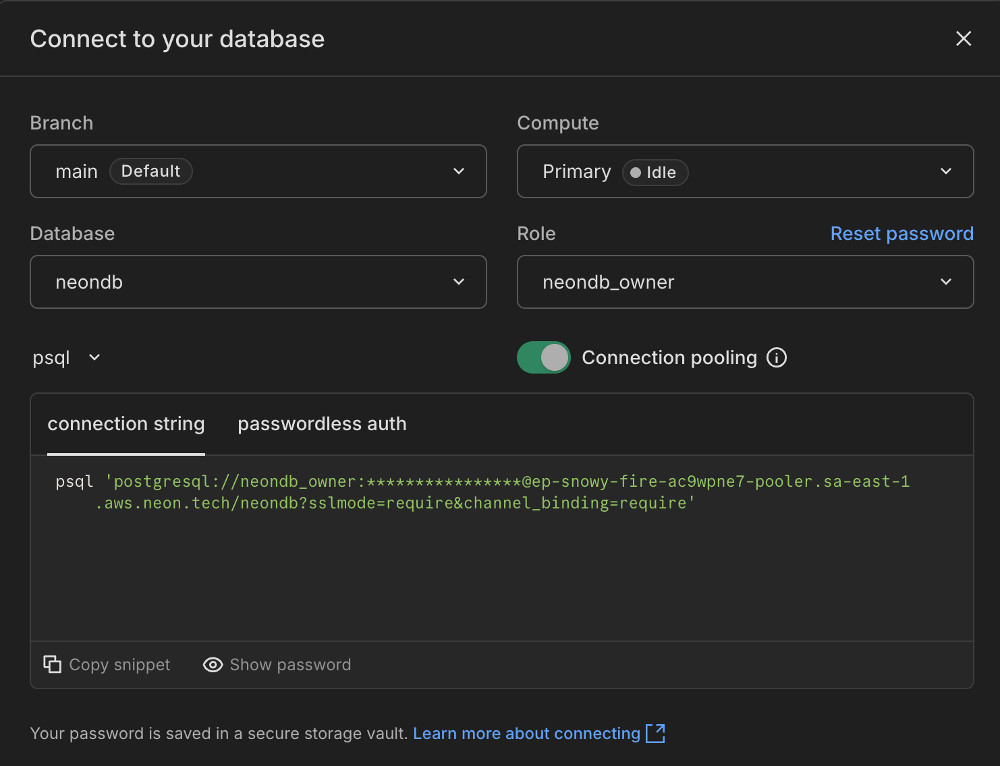
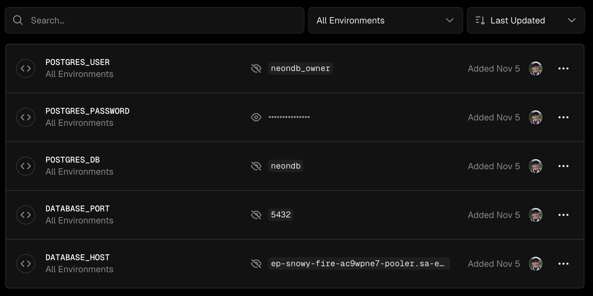
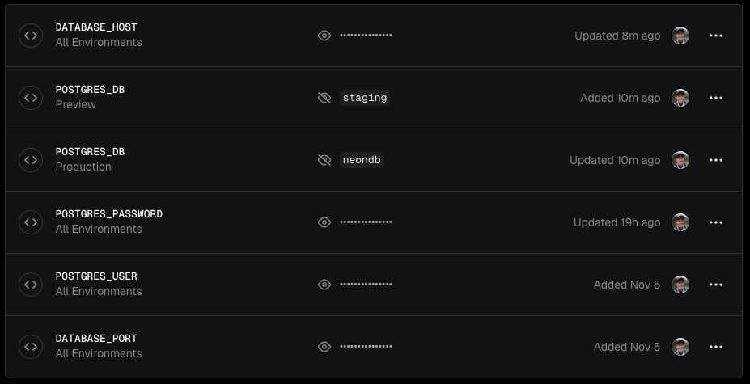
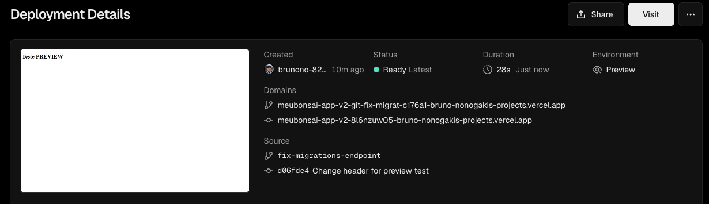
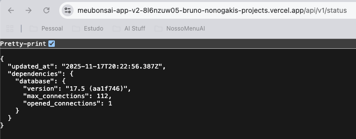

# Integrando um Banco de Dados de Produção e Staging

## Subindo um banco em produção

Para o Banco de Dados em produção e staging, podemos usar um serviço como o [neon.tech](https://neon.tech). Basta criar uma conta gratuita e iniciar um projeto novo. De lá, podemos pegar a Connection String, com os dados de conexão:



E vamos criar os valores do nosso ``.env.development`, mas dentro das variáveis de ambiente da Vercel:

```bash title="/.env.development (ambiente de desenvolvimento local)"
DATABASE_HOST=localhost
DATABASE_PORT=5432
POSTGRES_USER=dbadmin
POSTGRES_PASSWORD=!lab@DD123
POSTGRES_DB=postgres
```

Configuração na Vercel:


Dessa forma, quando rodarmos o código no ambiente de produção, o retorno da API Status será assim:

```json
{
  "updated_at": "2025-11-14T02:00:39.119Z",
  "dependencies": {
    "database": {
      "version": "17.5 (aa1f746)",
      "max_connections": 112,
      "opened_connections": 1
    }
  }
}
```

## Subindo um banco de staging

O banco de staging (pre-produção) também será no serviço da Neon. Para não ter que criar um novo projeto, vamos simplesmente criar um outro database dentro do mesmo projeto. Para isso, no Dashboard da Neon, basta seguir esses passos (pode ser que mude no futuro):

1. Em `Branches` > Selecione a sua branch `main`;
2. Logo abaixo das informações sobre a branch, há um menu com 3 abas: `Computes` | `Roles & Database` | `Child branches`;
3. Clique em `Roles & Database`, e depois em Add database.
4. Chamaremos essa nova database de `staging`
5. Voltando ao Project dashboard, clique em `Connect`, selecione a sua Database `staging`, e confira os dados de conexão. Provalmente a única diferença entre esse banco novo e o banco já existente para produção é o nome da Database. O de produção se chamava `neondb` (ou qualquer outro que você tenha configurado), e o novo de staging se chama `staging`.

Agora na Vercel, edite a variável de ambiente `POSTGRES_DB`, que criamos acima, alterando o Environments para `Production`. Dessa forma, quando for ambiente de Produção, ele consumirá esse valor do nosso banco de produção. Agora vamos criar uma outra variável com o mesmo nome `POSTGRES_DB`, mas selecionando setando o nome do nosso banco de staging: `staging`. Ao final, teremos duas variáveis POSTGRES_DB para cada ambiente (Production e Preview), e cada uma com um valor diferente:



## Testando um deploy em Staging

Por padrão, quando criamos uma branch nova no projeto, a Vercel já sobe essa versão em um ambiente de staging. Então vamos criar uma nova branch para testar.

```bash
git checkout -o fix-migrations-endpoint
```

Vamos fazer alguma alteração, como mudar o texto do H1, e depois commitar essa mudança:

```bash
git add -A
git commit -m "Fix Migrations Endpoint"
git push
```

A Vercel fará o deployment da versão Preview, criando um domínio novo para essa versão:


E se abrirmos a página de Status, podemos confirmar se o novo banco está respondendo:


Pronto! Agora temos um banco de produção e um banco de homologação!
