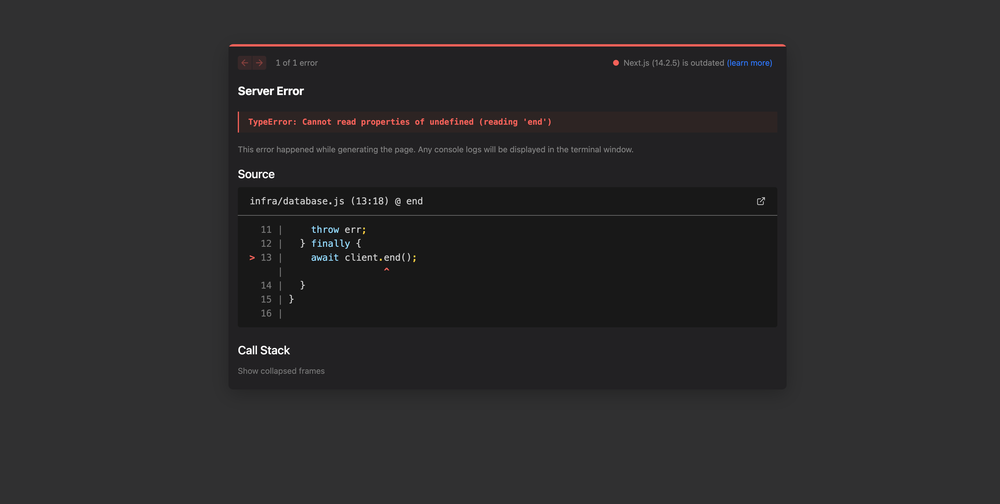

# Padronizando Erros

A forma como iremos tratar os Erros no projeto é através da classe Error, do Javascript. Por exemplo:

```javascript
function salvarUsuario(input) {
  if (!input) {
    throw new Error("falta-input");
  }
}

try {
  salvarUsuario();
} catch (error) {
  if (error.message === "falta-input") {
    console.log("É necessário enviar um 'input'.");
    console.log(error.stack);
  }
}
```

O output desse código será:

```
É necessário enviar um 'input'.
Error: mensagem-de-erro
    at salvarUsuario (/Users/bruno.nonogaki/Documents/@DEV/curso.dev-study-notes-mkdocs/test.js:3:11)
    at Object.<anonymous> (/Users/bruno.nonogaki/Documents/@DEV/curso.dev-study-notes-mkdocs/test.js:8:3)
    at Module._compile (node:internal/modules/cjs/loader:1364:14)
    at Module._extensions..js (node:internal/modules/cjs/loader:1422:10)
    at Module.load (node:internal/modules/cjs/loader:1203:32)
    at Module._load (node:internal/modules/cjs/loader:1019:12)
    at Function.executeUserEntryPoint [as runMain] (node:internal/modules/run_main:128:12)
    at node:internal/main/run_main_module:28:49
```

Mas um tratamento de erro assim, baseado em strings na propriedade message, e com ifs para cada situação é um tratamento frágil, e não é uma boa prática. Então podemos utilizar `erros customizados` criados por nós, extendendo da classe Error. O próprio Javascript já oferece alguns erros desses, que são erros especializados. Por exemplo: `ReferenceError`, `TypeError`, `SyntaxError`, `RangeError`. Vejamos alguns exemplos:

## ReferenceError

```javascript
function salvarUsuario(input) {
  if (!input) {
    throw new ReferenceError("É necessário enviar um 'input'");
  }
}

try {
  salvarUsuario();
} catch (error) {
  if (error instanceof ReferenceError) {
    console.log(error);
    return;
  }
}
```

Aí o log ficará assim:

```
ReferenceError: É necessário enviar um 'input'
    at salvarUsuario (/Users/bruno.nonogaki/Documents/@DEV/curso.dev-study-notes-mkdocs/test.js:3:11)
    at Object.<anonymous> (/Users/bruno.nonogaki/Documents/@DEV/curso.dev-study-notes-mkdocs/test.js:8:3)
    at Module._compile (node:internal/modules/cjs/loader:1364:14)
    at Module._extensions..js (node:internal/modules/cjs/loader:1422:10)
    at Module.load (node:internal/modules/cjs/loader:1203:32)
    at Module._load (node:internal/modules/cjs/loader:1019:12)
    at Function.executeUserEntryPoint [as runMain] (node:internal/modules/run_main:128:12)
    at node:internal/main/run_main_module:28:49
```

## TypeError

```javascript
function salvarUsuario(input) {
  if (!input) {
    throw new ReferenceError("É necessário enviar um 'input'");
  }

  if (!input.name) {
    throw new TypeError("É necessário enviar o 'name'");
  }
}

try {
  salvarUsuario({});
} catch (error) {
  if (error instanceof ReferenceError) {
    console.log(error);
    return;
  }
}
```

Aí o log ficará assim:

```
ReferenceError: Preencha o seu nome completo
    at salvarUsuario (/Users/bruno.nonogaki/Documents/@DEV/curso.dev-study-notes-mkdocs/test.js:7:11)
    at Object.<anonymous> (/Users/bruno.nonogaki/Documents/@DEV/curso.dev-study-notes-mkdocs/test.js:12:3)
    at Module._compile (node:internal/modules/cjs/loader:1364:14)
    at Module._extensions..js (node:internal/modules/cjs/loader:1422:10)
    at Module.load (node:internal/modules/cjs/loader:1203:32)
    at Module._load (node:internal/modules/cjs/loader:1019:12)
    at Function.executeUserEntryPoint [as runMain] (node:internal/modules/run_main:128:12)
    at node:internal/main/run_main_module:28:49
```

## Criando Erros customizados

Para criar erros customizados, criaremos uma nova classe chamada `ValidationError`, por exemplo:

```javascript
class ValidationError extends Error {
  constructor(message) {
    super(message);
  }
}

function salvarUsuario(input) {
  if (!input) {
    throw new ValidationError("É necessário enviar um 'input'");
  }

  if (!input.name) {
    throw new ValidationError("É necessário enviar o 'name'");
  }
}

try {
  salvarUsuario({});
} catch (error) {
  if (error instanceof ValidationError) {
    console.log(error);
    return;
  }
}
```

O output desse erro será:

```
ValidationError: É necessário enviar o 'name'
    at salvarUsuario (/Users/bruno.nonogaki/Documents/@DEV/curso.dev-study-notes-mkdocs/test.js:13:11)
    at Object.<anonymous> (/Users/bruno.nonogaki/Documents/@DEV/curso.dev-study-notes-mkdocs/test.js:18:3)
    at Module._compile (node:internal/modules/cjs/loader:1364:14)
    at Module._extensions..js (node:internal/modules/cjs/loader:1422:10)
    at Module.load (node:internal/modules/cjs/loader:1203:32)
    at Module._load (node:internal/modules/cjs/loader:1019:12)
    at Function.executeUserEntryPoint [as runMain] (node:internal/modules/run_main:128:12)
    at node:internal/main/run_main_module:28:49
```

Mas a grande vantagem do erro customizado, é que não precisamos ficar presos à propriedade `message`. Podemos criar as propriedades que quisermos! Por exemplo:

```javascript hl_lines = "4"
class ValidationError extends Error {
  constructor(message) {
    super(message);
    this.statusCode = 400;
  }
}
```

E agora o log será assim:

```hl_lines = "10"
ValidationError: É necessário enviar o 'name'
    at salvarUsuario (/Users/bruno.nonogaki/Documents/@DEV/curso.dev-study-notes-mkdocs/test.js:14:11)
    at Object.<anonymous> (/Users/bruno.nonogaki/Documents/@DEV/curso.dev-study-notes-mkdocs/test.js:19:3)
    at Module._compile (node:internal/modules/cjs/loader:1364:14)
    at Module._extensions..js (node:internal/modules/cjs/loader:1422:10)
    at Module.load (node:internal/modules/cjs/loader:1203:32)
    at Module._load (node:internal/modules/cjs/loader:1019:12)
    at Function.executeUserEntryPoint [as runMain] (node:internal/modules/run_main:128:12)
    at node:internal/main/run_main_module:28:49 {
  statusCode: 400
}
```

!!! tip

    E aí podemos criar vários outros erros customizados, como ValidationError (400), UnauthorizedError (401), NotFoundError (404), etc.

## Como estão os erros no nosso projeto hoje?

Para forçar um erro no projeto, vamos mudar a senha do banco de dados no nosso arquivo `.env.development` Ao fazer isso e acessarmos a página `api/v1/status`, repare o erro que está retornando:

```html
<!doctype html>
<html>
  <head>
    <style data-next-hide-fouc="true">
      body {
        display: none;
      }
    </style>
    <noscript data-next-hide-fouc="true"
      ><style>
        body {
          display: block;
        }
      </style></noscript
    >
    <meta charset="utf-8" />
    <meta name="viewport" content="width=device-width" />
    <meta name="next-head-count" content="2" />
    <noscript data-n-css=""></noscript>
    <script
      defer=""
      nomodule=""
      src="/_next/static/chunks/polyfills.js"
    ></script>
    <script src="/_next/static/chunks/webpack.js" defer=""></script>
    <script src="/_next/static/chunks/main.js" defer=""></script>
    <script src="/_next/static/chunks/pages/_app.js" defer=""></script>
    <script src="/_next/static/chunks/pages/_error.js" defer=""></script>
    <script src="/_next/static/development/_buildManifest.js" defer=""></script>
    <script src="/_next/static/development/_ssgManifest.js" defer=""></script>
    <noscript id="__next_css__DO_NOT_USE__"></noscript>
  </head>
  <body>
    <div id="__next"></div>
    <script src="/_next/static/chunks/react-refresh.js"></script>
    <script id="__NEXT_DATA__" type="application/json">
      {
        "props": { "pageProps": { "statusCode": 500 } },
        "page": "/_error",
        "query": {},
        "buildId": "development",
        "isFallback": false,
        "err": {
          "name": "TypeError",
          "source": "server",
          "message": "Cannot read properties of undefined (reading 'end')",
          "stack": "TypeError: Cannot read properties of undefined (reading 'end')\n    at Object.query (webpack-internal:///(api)/./infra/database.js:18:22)\n    at process.processTicksAndRejections (node:internal/process/task_queues:95:5)\n    at async get_postgres_version (webpack-internal:///(api)/./pages/api/v1/status.js:8:20)\n    at async status (webpack-internal:///(api)/./pages/api/v1/status.js:32:26)\n    at async K (/Users/bruno.nonogaki/Documents/@DEV/meubonsai-app-v2/node_modules/next/dist/compiled/next-server/pages-api.runtime.dev.js:21:2871)\n    at async U.render (/Users/bruno.nonogaki/Documents/@DEV/meubonsai-app-v2/node_modules/next/dist/compiled/next-server/pages-api.runtime.dev.js:21:3955)\n    at async DevServer.runApi (/Users/bruno.nonogaki/Documents/@DEV/meubonsai-app-v2/node_modules/next/dist/server/next-server.js:600:9)\n    at async NextNodeServer.handleCatchallRenderRequest (/Users/bruno.nonogaki/Documents/@DEV/meubonsai-app-v2/node_modules/next/dist/server/next-server.js:269:37)\n    at async DevServer.handleRequestImpl (/Users/bruno.nonogaki/Documents/@DEV/meubonsai-app-v2/node_modules/next/dist/server/base-server.js:816:17)\n    at async /Users/bruno.nonogaki/Documents/@DEV/meubonsai-app-v2/node_modules/next/dist/server/dev/next-dev-server.js:339:20\n    at async Span.traceAsyncFn (/Users/bruno.nonogaki/Documents/@DEV/meubonsai-app-v2/node_modules/next/dist/trace/trace.js:154:20)\n    at async DevServer.handleRequest (/Users/bruno.nonogaki/Documents/@DEV/meubonsai-app-v2/node_modules/next/dist/server/dev/next-dev-server.js:336:24)\n    at async invokeRender (/Users/bruno.nonogaki/Documents/@DEV/meubonsai-app-v2/node_modules/next/dist/server/lib/router-server.js:174:21)\n    at async handleRequest (/Users/bruno.nonogaki/Documents/@DEV/meubonsai-app-v2/node_modules/next/dist/server/lib/router-server.js:353:24)\n    at async requestHandlerImpl (/Users/bruno.nonogaki/Documents/@DEV/meubonsai-app-v2/node_modules/next/dist/server/lib/router-server.js:377:13)"
        },
        "gip": true,
        "scriptLoader": []
      }
    </script>
  </body>
</html>
%
```

Se acessarmos via browser, é isso que vemos:


!!! note

    Esse tipo de erro, apesar de ficar bonito na interface web, não é nada amigável para uma API, pois o consumidor dela não vai conseguir tratar os dados programatiamente. O ideal é que o retorno seja um JSON padronizado, que é o que faremos a seguir.

E na console do servidor, o erro é assim:

```bash
error: password authentication failed for user "devuser1"
    at Parser.parseErrorMessage (/Users/bruno.nonogaki/Documents/@DEV/meubonsai-app-v2/node_modules/pg-protocol/dist/parser.js:285:98)
    at Parser.handlePacket (/Users/bruno.nonogaki/Documents/@DEV/meubonsai-app-v2/node_modules/pg-protocol/dist/parser.js:122:29)
    at Parser.parse (/Users/bruno.nonogaki/Documents/@DEV/meubonsai-app-v2/node_modules/pg-protocol/dist/parser.js:35:38)
    at Socket.<anonymous> (/Users/bruno.nonogaki/Documents/@DEV/meubonsai-app-v2/node_modules/pg-protocol/dist/index.js:11:42)
    at Socket.emit (node:events:517:28)
    at addChunk (node:internal/streams/readable:368:12)
    at readableAddChunk (node:internal/streams/readable:341:9)
    at Readable.push (node:internal/streams/readable:278:10)
    at TCP.onStreamRead (node:internal/stream_base_commons:190:23) {
  length: 104,
  severity: 'FATAL',
  code: '28P01',
  detail: undefined,
  hint: undefined,
  position: undefined,
  internalPosition: undefined,
  internalQuery: undefined,
  where: undefined,
  schema: undefined,
  table: undefined,
  column: undefined,
  dataType: undefined,
  constraint: undefined,
  file: 'auth.c',
  line: '321',
  routine: 'auth_failed'
}
 ⨯ infra/database.js (13:18) @ end
 ⨯ TypeError: Cannot read properties of undefined (reading 'end')
    at Object.query (webpack-internal:///(api)/./infra/database.js:18:22)
    at process.processTicksAndRejections (node:internal/process/task_queues:95:5)
    at async get_postgres_version (webpack-internal:///(api)/./pages/api/v1/status.js:8:20)
    at async status (webpack-internal:///(api)/./pages/api/v1/status.js:32:26)
    at async K (/Users/bruno.nonogaki/Documents/@DEV/meubonsai-app-v2/node_modules/next/dist/compiled/next-server/pages-api.runtime.dev.js:21:2871)
    at async U.render (/Users/bruno.nonogaki/Documents/@DEV/meubonsai-app-v2/node_modules/next/dist/compiled/next-server/pages-api.runtime.dev.js:21:3955)
    at async DevServer.runApi (/Users/bruno.nonogaki/Documents/@DEV/meubonsai-app-v2/node_modules/next/dist/server/next-server.js:600:9)
    at async NextNodeServer.handleCatchallRenderRequest (/Users/bruno.nonogaki/Documents/@DEV/meubonsai-app-v2/node_modules/next/dist/server/next-server.js:269:37)
    at async DevServer.handleRequestImpl (/Users/bruno.nonogaki/Documents/@DEV/meubonsai-app-v2/node_modules/next/dist/server/base-server.js:816:17)
    at async /Users/bruno.nonogaki/Documents/@DEV/meubonsai-app-v2/node_modules/next/dist/server/dev/next-dev-server.js:339:20
    at async Span.traceAsyncFn (/Users/bruno.nonogaki/Documents/@DEV/meubonsai-app-v2/node_modules/next/dist/trace/trace.js:154:20)
    at async DevServer.handleRequest (/Users/bruno.nonogaki/Documents/@DEV/meubonsai-app-v2/node_modules/next/dist/server/dev/next-dev-server.js:336:24)
    at async invokeRender (/Users/bruno.nonogaki/Documents/@DEV/meubonsai-app-v2/node_modules/next/dist/server/lib/router-server.js:174:21)
    at async handleRequest (/Users/bruno.nonogaki/Documents/@DEV/meubonsai-app-v2/node_modules/next/dist/server/lib/router-server.js:353:24)
    at async requestHandlerImpl (/Users/bruno.nonogaki/Documents/@DEV/meubonsai-app-v2/node_modules/next/dist/server/lib/router-server.js:377:13) {
  page: '/api/v1/status'
}
  11 |     throw err;
  12 |   } finally {
> 13 |     await client.end();
     |                  ^
  14 |   }
  15 | }
  16 |
 GET /api/v1/status 500 in 26ms
```

Veja que ao quebrar a conexão com o banco, dois erros acontecem. Um é dentro do `database.js`, porque o bloco `finally` tenta fechar um client que está undefined porque caímos dentro do `catch`:

```javascript title="./infra/database.js" hl_lines="11"
async function query(queryObject) {
  let client;
  try {
    client = await getNewClient();
    const result = await client.query(queryObject);
    return result;
  } catch (err) {
    console.log("\n Erro dentro do catch do database.js:");
    console.error(err);
    throw err;
  } finally {
    await client.end();
  }
}
```

E na nossa página de `status.js`, como não conseguimos rodar a query, essa função vai dar um erro que não estamos tratando:

```javascript title="./pages/api/v1/status.js"
export default async function status(request, response) {
  const updatedAt = new Date().toISOString();
  response.status(200).json({
    updated_at: updatedAt,
    dependencies: {
      database: {
        version: await get_postgres_version(),
        max_connections: await get_postgres_max_connections(),
        opened_connections: await get_postgres_used_connections(),
      },
    },
  });
}
```

Vamos então colocar um try/catch nessa função para podermos capturar esse erro:

```javascript title="./pages/api/v1/status.js" hl_lines="2 14-17"
export default async function status(request, response) {
  try {
    const updatedAt = new Date().toISOString();
    response.status(200).json({
      updated_at: updatedAt,
      dependencies: {
        database: {
          version: await get_postgres_version(),
          max_connections: await get_postgres_max_connections(),
          opened_connections: await get_postgres_used_connections(),
        },
      },
    });
  } catch (err) {
    console.log(err);
    response.status(500).json({ error: "Internal Server Error" });
  }
}
```

Boa, agora quando fizermos um `GET` novamente nessa API, vamos receber apenas esse JSON, e não aquele HTML maluco:

```json
{ "error": "Internal Server Error" }
```

E para resolver o erro no nosso `database.js`, é só a gente arrumar o bloco de `finally`, fazendo com que ele faça o `end` da conexão apenas se o client estiver definido, tipo assim:

```javascript
if (client) {
  await client.end();
}
```

Mas para ficar mais bonito, podemos usar essa sintaxe, com `client?.end()`:

```javascript title="./infra/database.js" hl_lines="12"
async function query(queryObject) {
  let client;
  try {
    client = await getNewClient();
    const result = await client.query(queryObject);
    return result;
  } catch (err) {
    console.log("\n Erro dentro do catch do database.js:");
    console.error(err);
    throw err;
  } finally {
    await client?.end();
  }
}
```

!!! success

    Sucesso, agora temos a API retornando um erro mais programático, em JSON, que pode ser usado por quem estiver consumindo ela. E os logs do nosso projeto estão um pouco melhores, mas vamos melhorar mais ainda padronizando o retorno do erro e melhorando o display dos erros na console.

## Padronizando o retorno do erro

Para o projeto, vamos adotar a seguinte estrutura de retorno para os nossos erros da API:

```json
{
    "name": "NomeDoErro",
    "message": "Mensagem explicando o que aconteceu",
    "action": "Mensagem recomendando fazer alguma ação",
    "status_code": XXX
}
```

Já vimos como se cria erros customizados, criando uma classe herdando de `Errors`, né? Então, vamos criar um arquivo `errors.js` na pasta `infra`, e começar a criar lá as nossas classes de erros customizados, respeitando a estrutura acima. Já vamos de cara criar um erro genérico chamado InternalServerError para já usarmos no nosso projeto:

```javascript title="./infra/errors.js"
export class InternalServerError extends Error {
  constructor({ cause }) {
    super("Um erro interno não esperado aconteceu.", {
      cause: cause,
    });
    this.name = "InternalServerError";
    this.action = "Entre em contato com o suporte.";
    this.statusCode = 500;
  }

  toJSON() {
    return {
      name: this.name,
      message: this.message,
      action: this.action,
      status_code: this.statusCode,
    };
  }
}
```

!!! tip

    Criamos esse toJSON() porque por padrão o objeto Error tem propriedades não-enumeráveis. Quando tentamos fazer JSON.stringify() em um Error, ele retorna um {} vazio. O método toJSON() é chamado automaticamente pelo JSON.stringify(), permitindo que retornemos um objeto com os dados que queremos serializar. Dessa forma, será possível retorná-lo na nossa API para devolver para o client o JSON com esses dados.

    O parâmetro `cause` é uma forma padronizada (ECMAScript 2022) de encadear erros, mantendo a raiz do problema original. Quando você passa `cause: err`, está preservando o erro original dentro do novo erro customizado. Isso é útil para logging e debugging, pois você pode acessar `publicErrorObject.cause` para ver o erro original que causou o problema, enquanto retorna uma mensagem mais amigável ao cliente.

Agora vamos importar essa classe no arquivo `status.js` e retornar esse objeto no catch da função `status`. O arquivo completo atual vai ficar assim:

```javascript title="./pages/api/v1/status.js" hl_lines="2 35-43"
import database from "infra/database.js";
import { InternalServerError } from "infra/errors";

async function get_postgres_version() {
  const result = await database.query("SHOW server_version");
  return result.rows[0].server_version;
}

async function get_postgres_max_connections() {
  const result = await database.query("SHOW max_connections");
  return parseInt(result.rows[0].max_connections);
}

async function get_postgres_used_connections() {
  const result = await database.query({
    text: "SELECT COUNT(*)::int FROM pg_stat_activity WHERE datname = $1;",
    values: [process.env.POSTGRES_DB],
  });
  return result.rows[0].count;
}

export default async function status(request, response) {
  try {
    const updatedAt = new Date().toISOString();
    response.status(200).json({
      updated_at: updatedAt,
      dependencies: {
        database: {
          version: await get_postgres_version(),
          max_connections: await get_postgres_max_connections(),
          opened_connections: await get_postgres_used_connections(),
        },
      },
    });
  } catch (err) {
    const publicErrorObject = new InternalServerError({
      cause: err,
    });
    console.log("\n Erro dentro do catch do controller:");
    console.error(publicErrorObject);

    response.status(500).json(publicErrorObject);
  }
}
```

Vamos testar agora como vai ficar o erro quando chamamos a API `api/v1/status`:

```json
{
  "name": "InternalServerError",
  "message": "Um erro interno não esperado aconteceu.",
  "action": "Entre em contato com o suporte.",
  "status_code": 500
}
```

E o log no nosso servidor:

```bash hl_lines="1 31-32 47-48"
 Erro dentro do catch do database.js:
error: password authentication failed for user "devuser1"
    at Parser.parseErrorMessage (/Users/bruno.nonogaki/Documents/@DEV/meubonsai-app-v2/node_modules/pg-protocol/dist/parser.js:285:98)
    at Parser.handlePacket (/Users/bruno.nonogaki/Documents/@DEV/meubonsai-app-v2/node_modules/pg-protocol/dist/parser.js:122:29)
    at Parser.parse (/Users/bruno.nonogaki/Documents/@DEV/meubonsai-app-v2/node_modules/pg-protocol/dist/parser.js:35:38)
    at Socket.<anonymous> (/Users/bruno.nonogaki/Documents/@DEV/meubonsai-app-v2/node_modules/pg-protocol/dist/index.js:11:42)
    at Socket.emit (node:events:517:28)
    at addChunk (node:internal/streams/readable:368:12)
    at readableAddChunk (node:internal/streams/readable:341:9)
    at Readable.push (node:internal/streams/readable:278:10)
    at TCP.onStreamRead (node:internal/stream_base_commons:190:23) {
  length: 104,
  severity: 'FATAL',
  code: '28P01',
  detail: undefined,
  hint: undefined,
  position: undefined,
  internalPosition: undefined,
  internalQuery: undefined,
  where: undefined,
  schema: undefined,
  table: undefined,
  column: undefined,
  dataType: undefined,
  constraint: undefined,
  file: 'auth.c',
  line: '321',
  routine: 'auth_failed'
}

 Erro dentro do catch do controller:
InternalServerError: Um erro interno não esperado aconteceu.
    at status (webpack-internal:///(api)/./pages/api/v1/status.js:42:35)
    at process.processTicksAndRejections (node:internal/process/task_queues:95:5)
    at async K (/Users/bruno.nonogaki/Documents/@DEV/meubonsai-app-v2/node_modules/next/dist/compiled/next-server/pages-api.runtime.dev.js:21:2871)
    at async U.render (/Users/bruno.nonogaki/Documents/@DEV/meubonsai-app-v2/node_modules/next/dist/compiled/next-server/pages-api.runtime.dev.js:21:3955)
    at async DevServer.runApi (/Users/bruno.nonogaki/Documents/@DEV/meubonsai-app-v2/node_modules/next/dist/server/next-server.js:600:9)
    at async NextNodeServer.handleCatchallRenderRequest (/Users/bruno.nonogaki/Documents/@DEV/meubonsai-app-v2/node_modules/next/dist/server/next-server.js:269:37)
    at async DevServer.handleRequestImpl (/Users/bruno.nonogaki/Documents/@DEV/meubonsai-app-v2/node_modules/next/dist/server/base-server.js:816:17)
    at async /Users/bruno.nonogaki/Documents/@DEV/meubonsai-app-v2/node_modules/next/dist/server/dev/next-dev-server.js:339:20
    at async Span.traceAsyncFn (/Users/bruno.nonogaki/Documents/@DEV/meubonsai-app-v2/node_modules/next/dist/trace/trace.js:154:20)
    at async DevServer.handleRequest (/Users/bruno.nonogaki/Documents/@DEV/meubonsai-app-v2/node_modules/next/dist/server/dev/next-dev-server.js:336:24)
    at async invokeRender (/Users/bruno.nonogaki/Documents/@DEV/meubonsai-app-v2/node_modules/next/dist/server/lib/router-server.js:174:21)
    at async handleRequest (/Users/bruno.nonogaki/Documents/@DEV/meubonsai-app-v2/node_modules/next/dist/server/lib/router-server.js:353:24)
    at async requestHandlerImpl (/Users/bruno.nonogaki/Documents/@DEV/meubonsai-app-v2/node_modules/next/dist/server/lib/router-server.js:377:13)
    at async Server.requestListener (/Users/bruno.nonogaki/Documents/@DEV/meubonsai-app-v2/node_modules/next/dist/server/lib/start-server.js:141:13) {
  action: 'Entre em contato com o suporte.',
  statusCode: 500,
  [cause]: error: password authentication failed for user "devuser1"
      at Parser.parseErrorMessage (/Users/bruno.nonogaki/Documents/@DEV/meubonsai-app-v2/node_modules/pg-protocol/dist/parser.js:285:98)
      at Parser.handlePacket (/Users/bruno.nonogaki/Documents/@DEV/meubonsai-app-v2/node_modules/pg-protocol/dist/parser.js:122:29)
      at Parser.parse (/Users/bruno.nonogaki/Documents/@DEV/meubonsai-app-v2/node_modules/pg-protocol/dist/parser.js:35:38)
      at Socket.<anonymous> (/Users/bruno.nonogaki/Documents/@DEV/meubonsai-app-v2/node_modules/pg-protocol/dist/index.js:11:42)
      at Socket.emit (node:events:517:28)
      at addChunk (node:internal/streams/readable:368:12)
      at readableAddChunk (node:internal/streams/readable:341:9)
      at Readable.push (node:internal/streams/readable:278:10)
      at TCP.onStreamRead (node:internal/stream_base_commons:190:23) {
    length: 104,
    severity: 'FATAL',
    code: '28P01',
    detail: undefined,
    hint: undefined,
    position: undefined,
    internalPosition: undefined,
    internalQuery: undefined,
    where: undefined,
    schema: undefined,
    table: undefined,
    column: undefined,
    dataType: undefined,
    constraint: undefined,
    file: 'auth.c',
    line: '321',
    routine: 'auth_failed'
  }
}
 GET /api/v1/status 500 in 97ms
```
