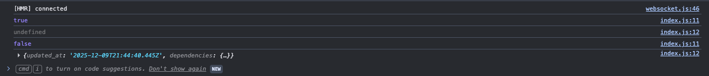
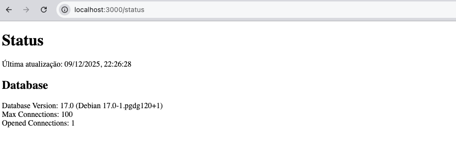

# Criando a página `/status`

Essa vai ser a nossa primeira página de verdade no Front, e o objetivo dela é pegar as informações de status da nossa API e exibir na tela. Por enquanto não estamos preocupados com a formatação e nem nada disso, é só para iniciarmos alguma coisa no front-end React.

## Criando o arquivo da página `/status`

Primeiramente, vamos criar uma pasta chamada `status` no diretório `pages`, e criar um arquivo `index.js` lá dentro.

```bash
mkdir -p pages/status
touch pages/status/index.js
```

!!! tip

        Como o Next é file-based routing, só isso já é o suficiente para criar a página

## Iniciando o arquivo `index.js`

Vamos inicialmente criar a estrutra mais básica possível para esse arquivo, que vai nos retornar basicamente um cabeçalho escrito Status.

```javascript title="./pages/status/index.js"
export default function StatusPage() {
  return (
    <>
      <h1>Status</h1>
    </>
  );
}
```

## Criando um componente \<CapsLock\>

Agora, nesse mesmo arquivo, vamos criar um componente chamado `\<CapsLock\>`, que vai receber um texto, e retorná-lo em caixa alta.

```javascript title="./pages/status/index.js"
function CapsLock(props) {
  const textoEmCapsLock = props.texto.toUpperCase();
  return textoEmCapsLock;
}

export default function StatusPage() {
  return (
    <>
      <h1>Status</h1>
      <CapsLock texto="meu texto em caixa alta" />
    </>
  );
}
```

Ok, esse componente não serve lá para muita coisa, mas é só para termos uma base do que é um componente no React, como se passa propriedades para ele, e faz ele retornar um conteúdo para ser renderizado. Mas agora, e se ao invés disso, a gente criar uma função chamada `fetchStatus`, que faz um GET na nossa API e retorna o conteúdo? Vamos ver se rola:

```javascript title="./pages/status/index.js"
async function fetchStatus() {
  const response = await fetch("api/v1/status");
  const responseBody = await response.json();
  return responseBody;
}

export default function StatusPage() {
  console.log(fetchStatus());
  return (
    <>
      <h1>Status</h1>
      <fetchStatus />
    </>
  );
}
```

!!! note

    Note que fazemos o GET com o comando `fetch`, da mesma forma que fizemos os nossos testes automatizados no Jest! Por enquanto, estamos dando apenas um console.log na Promise que vem como retorno da função async. Para obtermos o dado mesmo, precisaremos de um `Data Fetching`.

## Data Fetcher

Quando realizamos um Fetch em uma API, muitas coisas erradas podem acontecer no processo. Pode dar algum erro na conexão com o backend, pode ter problema de request duplicado e cancelado, pode dar problemas de respostas não formatadas, etc. Por isso, a comunidade do React passou a desrecomendar os fetchings direto, e colocar um cara no meio para gerenciar essas requisições. Esse é o nosso `Data Fetcher`: um cara que consegue abstrair e gerenciar melhor os requests ao Backend.

Os dois módulos mais populares de Data Fetcher são:

- SWR: Criado pela Vercel
- React Query: Faz parte do TanStack, e é o módulo mais popular

E aqui nesse projeto, usaremos o `SWR`. Vamos instalá-lo exatamente na versão 2.2.5:

```bash
npm install --save-exact swr@2.2.5
```

E para utilizá-lo, invocaremos o hook `useSWR`. Abordaremos sobre hooks do React mais pra frente, mas por hora, vamos testar esse código aqui:

```javascript title="./pages/status/index.js" hl_lines="1 10-12"
import useSWR from "swr";

async function fetchStatus() {
  const response = await fetch("api/v1/status");
  const responseBody = await response.json();
  return responseBody;
}

export default function StatusPage() {
  const response = useSWR("status", fetchStatus);
  console.log(response.isLoading);
  console.log(response.data);

  return (
    <>
      <h1>Status</h1>
      <fetchStatus />
    </>
  );
}
```

!!! note

    Veja que interessante, a linha `const response = useSWR("status", fetchStatus)` não é async, ela não bloqueia a página. Conforme o useSWR executa a sua tarefa, ele pede para o React processar o componente novamente. Se colocarmos um console.log, é possível ver exatamente esse comportamento, onde ele começa com o response.isLoading como true, e com o response.data como Undefined. E logo em seguida, o response.isLoading muda para false, e o response.data tem o resultado da nossa request. Isso pode ser usado, por exemplo, para exibir uma mensagem de carregamento na tela antes de os dados da nossa API serem retornados para o Front!

    

Então agora é só renderizarmos o JSON do `response.data`, e podemos colocar um refreshInterval no useSWR para ele fazer o requet a cada 2 segundos:

```javascript title="./pages/status/index.js"
import useSWR from "swr";

async function fetchStatus() {
  const response = await fetch("api/v1/status");
  const responseBody = await response.json();
  return responseBody;
}

export default function StatusPage() {
  const response = useSWR("status", fetchStatus, { refreshInterval: 2000 });

  return (
    <>
      <h1>Status</h1>
      <pre>{JSON.stringify(response.data, null, 2)}</pre>
    </>
  );
}
```

!!! note

    O SWR vem com um conceito chamado `deduping`. Quando é feito um request para a nossa API usando a mesma chave (que é aquele valor "status" que passamos como primeiro parâmetro no useSWR), ele guarda na memória o retorno por 2 segundos, então se houver outra chamada igual nesse intervalo, ele retorna direto o dado que está em cache. Por isso, mesmo que a gente mude o refreshInterval para 100ms, ainda assim o refresh só ocorrerá a cada 2 segundos, que é o tempo padrão do deduping. Para alterar isso, basta passar a chave dedupingInterval, por exemplo:
    ```javascript
    const response = useSWR("status", fetchStatus, {
      refreshInterval: 100,
      dedupingInterval: 100
    });
    ```

Por fim, uma pequena refatoração para deixarmos a função fetchStatus mais genérica, recebendo o nome da chave como parâmetro. Agora podemos inclusive renomear a função para fetchAPI, porque ela pode ser usada para outras coisas, e não apenas para Status:

```javascript title="./pages/status/index.js"
import useSWR from "swr";

async function fetchAPI(key) {
  const response = await fetch(key);
  const responseBody = await response.json();
  return responseBody;
}

export default function StatusPage() {
  const response = useSWR("api/v1/status", fetchAPI, {
    refreshInterval: 2000,
  });

  return (
    <>
      <h1>Status</h1>
      <pre>{JSON.stringify(response.data, null, 2)}</pre>
    </>
  );
}
```

## Refatorando a página

Agora vamos para a refatoração final, utilizando componentes responsáveis por cada pedaço da página de status:

```javascript title="./pages/status/index.js"
import useSWR from "swr";

async function fetchAPI(key) {
  const response = await fetch(key);
  const responseBody = await response.json();
  return responseBody;
}

export default function StatusPage() {
  return (
    <>
      <h1>Status</h1>
      <UpdatedAt />
      <h2>Database</h2>
      <DatabaseStatus />
    </>
  );
}

function UpdatedAt() {
  const { isLoading, data } = useSWR("api/v1/status", fetchAPI, {
    refreshInterval: 2000,
  });

  let updatedAtText = "Carregando...";

  if (!isLoading && data) {
    updatedAtText = new Date(data.updated_at).toLocaleString("pt-BR");
  }

  return <div>Última atualização: {updatedAtText}</div>;
}

function DatabaseStatus() {
  const { isLoading, data } = useSWR("api/v1/status", fetchAPI, {
    refreshInterval: 2000,
  });

  let databaseVersion = "Carregando...";
  let databaseMaxConnctions = "Carregando...";
  let databaseOpenedConnections = "Carregando...";

  if (!isLoading && data) {
    databaseVersion = data.dependencies.database.version;
    databaseMaxConnctions = data.dependencies.database.max_connections;
    databaseOpenedConnections = data.dependencies.database.opened_connections;
  }

  return (
    <>
      <li>Database Version: {databaseVersion}</li>
      <li>Max Connections: {databaseMaxConnctions}</li>
      <li>Opened Connections: {databaseOpenedConnections}</li>
    </>
  );
}
```

!!! success

    Sucesso, temos a nossa primeira página consumindo dados da API, tratando, e exibindo na tela. Ainda tudo simples e sem formatação, mas vamos melhorando aos poucos!

    
