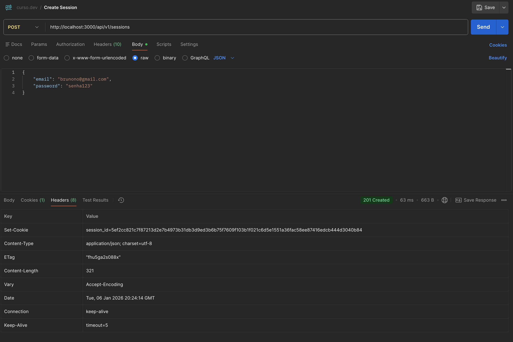
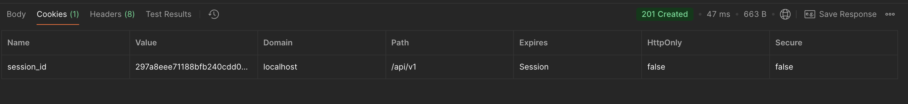
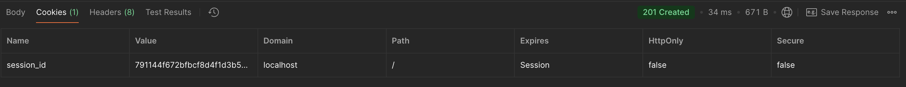
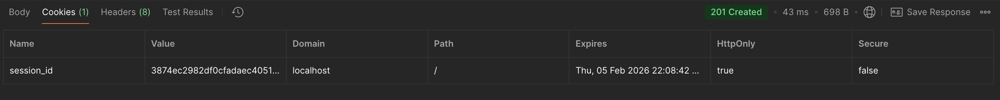
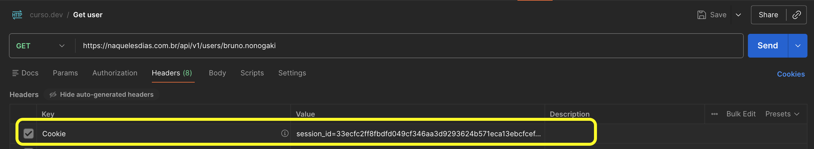

# Implementando a Autenticação baseada em Sessão

Agora que já temos os nossos usuários criados, vamos primeiramente implementar a **Autenticação**, para depois pensarmos na **Autorização**.
A ideia aqui é usarmos autenticação baseada em sessão, então o usuário vai enviar um `POST` para `/api/v1/sessions` informando o e-mail e senha, o backend fará a validação, criará uma sessão, e devolverá o token dela junto com um `Set-Cookie`. Com isso, o navegador salvará esse cookie no Cookie Jar, e passará a enviá-lo nas futuras requisições.

Como sempre, vamos começar com os testes. Usando o método "guerrilha", cobriremos primeiro os casos de erro, para depois cobrir o caso de sucesso.

## Caso 1: E-mail não encontrado

Vamos criar a estrutura de testes, e cobrir o caso de uma tentativa de criação de sessão com um email inexistente. Nesse caso, queremos que o sistema retorne um erro `401 UNAUTHORIZED`.

```javascript title="./tests/integration/api/v1/sessions/post.test.js"
import orchestrator from "tests/orchestrator";

beforeAll(async () => {
  await orchestrator.waitForAllServices();
  await orchestrator.clearDatabase();
  await orchestrator.runPendingMigrations();
});

describe("POST to /api/v1/sessions", () => {
  describe("Anonymous user", () => {
    test("With incorrect email but correct password", async () => {
      const createdUser = await orchestrator.createUser({
        email: "usuario@email.com",
        password: "senha-correta",
      });
      const response = await fetch("http://localhost:3000/api/v1/sessions", {
        method: "POST",
        headers: {
          "Content-Type": "application/json",
        },
        body: JSON.stringify({
          email: "email.errado@email.com",
          password: createdUser.password,
        }),
      });

      expect(response.status).toBe(401);
      const responseBody = await response.json();
      expect(responseBody).toEqual({
        name: "UnauthorizedError",
        message: "Dados de autenticação não conferem.",
        action: "Verifique se os dados enviados estão corretos.",
        status_code: 401,
      });
    });
  });
});
```

E agora vamos criar a rota de sessions:

```javascript title="./pages/api/v1/sessions/index.js"
import { createRouter } from "next-connect";
import controller from "infra/controller.js";
import user from "models/user.js";

const router = createRouter();

router.post(postHandler);

export default router.handler(controller.errorHandler);

async function postHandler(request, response) {
  const userInputValues = request.body;
  const userFound = await user.findOneByEmail(userInputValues.email);

  return response.status(200).json({});
}
```

Agora precisamos criar um novo método no model de `user` chamado `findOneByEmail`, porque por enquanto só temos criado o `findOneByUsername`.

```javascript title="./models/user.js"
// restante do código deste arquivo foi ocultado

async function findOneByEmail(email) {
  const userFound = await runSelectQuery(email);
  return userFound;

  async function runSelectQuery(email) {
    const results = await database.query({
      text: `
        SELECT 
          *
        FROM
          users
        WHERE
          LOWER(email) = LOWER($1)
        LIMIT 1
      `,
      values: [email],
    });
    if (results.rowCount === 0) {
      throw new NotFoundError({
        message: "O email informado não foi encontrado no sistema.",
        action: "Verifique se o email está digitado corretamente.",
      });
    } else {
      return results.rows[0];
    }
  }
}

const user = {
  create,
  findOneByUsername,
  findOneByEmail, // <= Adicionando o método no export
  update,
};
```

!!! warning

    Mas veja que dessa forma, a nossa API vai retornar um error 404 gerado pelo método `findOneByEmail`, e não é isso que queremos. Não queremos expor que a autenticação falhou porque o e-mail não estava na base. Para qualquer problema de autenticação, queremos lançar apenas um erro genérico 401, não dando pistas a um suposto atacante sobre qual foi o problema específico na autenticação. Por isso, vamos sobrescrever esse erro dentro do controller, implementando um `try`

```javascript title="./pages/api/v1/sessions/index.js" hl_lines="4 15-23"
import { createRouter } from "next-connect";
import controller from "infra/controller.js";
import user from "models/user.js";
import { UnauthorizedError } from "infra/errors.js";

const router = createRouter();

router.post(postHandler);

export default router.handler(controller.errorHandler);

async function postHandler(request, response) {
  const userInputValues = request.body;

  try {
    const userFound = await user.findOneByEmail(userInputValues.email);
  } catch (error) {
    throw new UnauthorizedError({
      message: "Dados de autenticação não conferem.",
      action: "Verifique se os dados enviados estão corretos.",
    });
  }

  return response.status(200).json({});
}
```

E agora vamos criar o erro `UnauthorizedError`:

```javascript title="./infra/errors.js"
export class UnauthorizedError extends Error {
  constructor({ cause, message, action }) {
    super(message || "Usuário não autenticado.", {
      cause: cause,
    });
    this.name = "UnauthorizedError";
    this.action = action || "Verifique se os dados enviados estão corretos.";
    this.statusCode = 401;
  }

  toJSON() {
    return {
      name: this.name,
      message: this.message,
      action: this.action,
      status_code: this.statusCode,
    };
  }
}
```

E por fim, sobrescrever a reposta desse erro no `onErrorHandler` do `controller.js`:

```javascript title="./infra/controller.js" hl_lines="5"
function onErrorHandler(error, request, response) {
  if (
    error instanceof ValidationError ||
    error instanceof NotFoundError ||
    error instanceof UnauthorizedError
  ) {
    return response.status(error.statusCode).json(error);
  }

  const publicErrorObject = new InternalServerError({
    cause: error,
    statusCode: error.statusCode,
  });

  console.error(publicErrorObject);

  response.status(publicErrorObject.statusCode).json(publicErrorObject);
}
```

!!! success

    Sucesso, agora o nosso primeiro teste está passando!

## Caso 2: Password incorreto

Agora vamos cobrir o caso de o e-mail existir na base, mas a senha estar incorreta:

```javascript title="./tests/integration/api/v1/sessions/post.test.js"
describe("POST to /api/v1/sessions", () => {
  describe("Anonymous user", () => {
    test("With incorrect email but correct password", async () => {
      // Ocultado
    });
    test("With correct email but incorrect password", async () => {
      const createdUser = await orchestrator.createUser({
        email: "email.correto@email.com",
        password: "senha-correta",
      });
      const response = await fetch("http://localhost:3000/api/v1/sessions", {
        method: "POST",
        headers: {
          "Content-Type": "application/json",
        },
        body: JSON.stringify({
          email: createdUser.email,
          password: "senha-incorreta",
        }),
      });

      expect(response.status).toBe(401);
      const responseBody = await response.json();
      expect(responseBody).toEqual({
        name: "UnauthorizedError",
        message: "Dados de autenticação não conferem.",
        action: "Verifique se os dados enviados estão corretos.",
        status_code: 401,
      });
    });
  });
});
```

Vamos adicionar essa validação no controller. Note que já temos um método `compare` no model `password.js`, então basta importarmos esse método:

```javascript title="./pages/api/v1/sessions/index.js" hl_lines="5 18-24"
import { createRouter } from "next-connect";
import controller from "infra/controller.js";
import user from "models/user.js";
import { UnauthorizedError } from "infra/errors.js";
import password from "models/password";

const router = createRouter();

router.post(postHandler);

export default router.handler(controller.errorHandler);

async function postHandler(request, response) {
  const userInputValues = request.body;

  try {
    const userFound = await user.findOneByEmail(userInputValues.email);
    const correctPasswordMatch = await password.compare(
      userInputValues.password,
      userFound.password,
    );
    if (!correctPasswordMatch) {
      throw Error;
    }
  } catch (error) {
    throw new UnauthorizedError({
      message: "Dados de autenticação não conferem.",
      action: "Verifique se os dados enviados estão corretos.",
    });
  }

  return response.status(200).json({});
}
```

## Refatorando o código e criando o model `authentication`

Apenas para fins de organização, e deixar o controller de sessions mais simples, vamos criar um model novo para tratar apenas a autenticação. Basicamente criaremos um novo método chamado `getAuthenticatedUser`, que vai fazer a verificação se o usuário existe, e validar a senha. Todo o tratamento de erros será passado para dentro dele, e logaremos o erro 401 apenas no caso de falha de autenticação. Qualquer outra falha no código em si, como por exemplo o banco de dados estar fora, apenas lançaremos o erro para ser tratado por uma camada acima. Abaixo já o código refatorado.

```javascript title="./pages/api/v1/sessions/index.js"
import { createRouter } from "next-connect";
import controller from "infra/controller.js";
import authentication from "models/authentication.js";

const router = createRouter();

router.post(postHandler);

export default router.handler(controller.errorHandler);

async function postHandler(request, response) {
  const userInputValues = request.body;

  const authenticatedUser = await authentication.getAuthenticatedUser(
    userInputValues.email,
    userInputValues.password,
  );

  return response.status(200).json({});
}
```

E o novo model `authentication`:

```javascript title="./models/authentication.js"
import user from "models/user.js";
import { NotFoundError, UnauthorizedError } from "infra/errors.js";
import password from "models/password";

async function getAuthenticatedUser(providedEmail, providedPassword) {
  try {
    const userFound = await findUserByEmail(providedEmail);
    await validatePassword(providedPassword, userFound.password);
    return userFound;
  } catch (error) {
    if (error instanceof UnauthorizedError) {
      throw new UnauthorizedError({
        message: "Dados de autenticação não conferem.",
        action: "Verifique se os dados enviados estão corretos.",
      });
    }
    throw error;
  }

  async function findUserByEmail(providedEmail) {
    let userFound;
    try {
      userFound = await user.findOneByEmail(providedEmail);
    } catch (error) {
      if (error instanceof NotFoundError) {
        throw new UnauthorizedError({
          message: "Dados de autenticação não conferem.",
          action: "Verifique se os dados enviados estão corretos.",
        });
      }
      throw error;
    }
    return userFound;
  }

  async function validatePassword(providedPassword, storedPassword) {
    try {
      const correctPasswordMatch = await password.compare(
        providedPassword,
        storedPassword,
      );

      if (!correctPasswordMatch) {
        throw new UnauthorizedError({
          message: "Senha incorreta.",
          action: "Verifique se os dados enviados estão corretos.",
        });
      }
    } catch (error) {
      if (error instanceof UnauthorizedError) {
        throw new UnauthorizedError({
          message: "Dados de autenticação não conferem.",
          action: "Verifique se os dados enviados estão corretos.",
        });
      }
      throw error;
    }
  }
}

const authentication = {
  getAuthenticatedUser,
};

export default authentication;
```

## Autenticação com Sucesso: Criando a Sessão

Agora vamos programar a autenticação com sucesso. Depois de validar o usuário e senha, teremos que criar uma nova sessão e armazená-la no Banco de Dados, e retornar um Cookie para o cliente. A sessão será armazenada no próprio Postgres, e não num Redis da vida. O projeto fica muito mais simples e a "perda" de performance é praticamente irrisória.

### Criando a tabela `Sessions`

Primeiramente, vamos criar uma tabela nova no banco de dados chamada `sessions`. Faremos isso através de uma migration:

```bash
npm run migrations:create create sessions
```

E agora vamos ediar o arquivo de migração, criando as colunas necessárias:

```javascript title="./infra/migrations/xxxxxxxx_create-sessions.js"
exports.up = (pgm) => {
  pgm.createTable("sessions", {
    id: {
      type: "uuid",
      primaryKey: true,
      default: pgm.func("gen_random_uuid()"),
    },
    token: {
      type: "varchar(96)",
      notNull: true,
      unique: true,
    },
    user_id: {
      type: "uuid",
      notNull: true,
      // references: "users" // foreign key (talvez não seja tão necessário...)
    },
    expires_at: {
      type: "timestamptz",
      notNull: true,
    },
    created_at: {
      type: "timestamptz",
      default: pgm.func("timezone('utc', now())"),
      notNull: true,
    },
    updated_at: {
      type: "timestamptz",
      default: pgm.func("timezone('utc', now())"),
      notNull: true,
    },
  });
};

exports.down = false;
```

!!! tip

    A maioria dos tutoriais da internet vai recomendar criar o campo user_id como uma FK da tabela `users`. Mas será que isso é realmente necessário? 🤔

Ok, tabela criada, agora vamos cobrir o teste de autenticação com sucesso:

```javascript title="./tests/integration/api/v1/sessions/post.test.js"
describe("POST to /api/v1/sessions", () => {
  describe("Anonymous user", () => {
    // demais testes foram ocultados do arquivo

    test("With correct email and correct password", async () => {
      const createdUser = await orchestrator.createUser({
        email: "correct.email@email.com",
        password: "senha-correta",
      });
      const response = await fetch("http://localhost:3000/api/v1/sessions", {
        method: "POST",
        headers: {
          "Content-Type": "application/json",
        },
        body: JSON.stringify({
          email: createdUser.email,
          password: "senha-correta",
        }),
      });

      expect(response.status).toBe(201);
      const responseBody = await response.json();
      expect(responseBody).toEqual({
        id: responseBody.id,
        token: responseBody.token,
        user_id: createdUser.id,
        created_at: responseBody.created_at,
        updated_at: responseBody.updated_at,
        expires_at: responseBody.expires_at,
      });
      expect(uuidVersion(responseBody.id)).toBe(4);
      expect(Date.parse(responseBody.created_at)).not.toBeNaN();
      expect(Date.parse(responseBody.created_at)).not.toBeNaN();

      // Validando se a expiração é de 30 dias
      const createdAt = new Date(responseBody.created_at);
      const expiresAt = new Date(responseBody.expires_at);
      expiresAt.setMilliseconds(0);
      createdAt.setMilliseconds(0);
      expect(expiresAt - createdAt).toBe(session.EXPIRATION_IN_MILLISECONDS);
    });
  });
});
```

A ideia do teste é passar um usuário e senha correto, o que a API deveria validar e nos retornar um `201 CREATED`, com o Body contendo o id, o token, o user_id e as datas de criação, expiração e update. Queremos validar também que a expiração do token é de 30 dias depois da criação.

Certo! Agora no controller, vamos supor que exista um model chamado `session`, que tenha um método chamado `create`, que vai receber o ID do usuário autenticado, criar a sessão no banco e retornar os dados dela. Esse método ainda não existe, mas do ponto de vista de controller, podemos simplesmente chamá-lo assim:

```javascript title="./pages/api/v1/sessions/index.js" hl_lines="4 20"
import { createRouter } from "next-connect";
import controller from "infra/controller.js";
import authentication from "models/authentication.js";
import session from "models/session.js";

const router = createRouter();

router.post(postHandler);

export default router.handler(controller.errorHandler);

async function postHandler(request, response) {
  const userInputValues = request.body;

  const authenticatedUser = await authentication.getAuthenticatedUser(
    userInputValues.email,
    userInputValues.password,
  );

  const newSession = await session.create(authenticatedUser.id);
  return response.status(201).json(newSession);
}
```

E agora vamos criar o model, que terá toda essa abstração da criação da sessão:

```javascript title="./models/session.js"
import crypto from "node:crypto";
import database from "infra/database.js";

const EXPIRATION_IN_MILLISECONDS = 60 * 60 * 24 * 30 * 1000; // 30 dias em milisegundos

async function create(userId) {
  // cria 48 bytes aleatorios e converte em uma string em hexadecimal,
  // onde cada byte é representado por 2 caracteres, totalizando uma string de 96 caracteres
  const token = crypto.randomBytes(48).toString("hex");

  // Data atual somada a 30 dias para frente
  const expiresAt = new Date(Date.now() + EXPIRATION_IN_MILLISECONDS);

  const newSession = await runInsertQuery(token, userId, expiresAt);
  return newSession;

  async function runInsertQuery(token, userId, expiresAt) {
    const results = await database.query({
      text: `
        INSERT INTO
          sessions (token, user_id, expires_at)
        VALUES
          ($1, $2, $3)
        RETURNING *
      ;`,
      values: [token, userId, expiresAt],
    });
    return results.rows[0];
  }
}

const session = {
  create,
  EXPIRATION_IN_MILLISECONDS,
};

export default session;
```

!!! success

    Pronto! Nosso sistema já está criando uma sessão e salvando ela no banco de dados. Por enquanto, não estamos fazendo nada, apenas criando strings, basicamente. Então precisamos retornar essa sessão ao cliente em um `Set-Cookie`, para ser usada pelo navegador. É isso que faremos a seguir!

## Retornando o Cookie de Sessão

Agora só o que precisamos fazer depois de criar a sessão, é retornar ela ao usuário através do envio do token no cabeçalho da resposta, no parâmetro `Set-Cookie`. O navegador então sabe que ele precisa pegar esse token e salvar dentro do Cookie Jar dele.

Então no controller do sessions, precisamos adicionar esse novo header na response.

```javascript title="./pages/api/v1/sessions/index.js" hl_lines="22"
import { createRouter } from "next-connect";
import controller from "infra/controller.js";
import authentication from "models/authentication.js";
import session from "models/session.js";

const router = createRouter();

router.post(postHandler);

export default router.handler(controller.errorHandler);

async function postHandler(request, response) {
  const userInputValues = request.body;

  const authenticatedUser = await authentication.getAuthenticatedUser(
    userInputValues.email,
    userInputValues.password,
  );

  const newSession = await session.create(authenticatedUser.id);

  response.setHeader("Set-Cookie", `session_id=${newSession.token}`);

  return response.status(201).json(newSession);
}
```

Somente com isso, agora quando enviarmos um POST para o `/api/v1/sessions` com um usuário válido, o Backend vai responder com o header `Set-Cookie`, assim:



Com essa instrução de `Set-Cookie`, o servidor intrui o cliente a guardar esse cookie no seu Cookie Jar. No próprio Postman, clicando em Cookies, é possível ver esse Cookie salvo lá:



Os Cookie jars são segmentados por URL de origem. Então nesse caso, a nossa URL é o localhost. Por padrão, a RFC determina que o cookie estará diponível no endereço até a última barra. Como mandamos o request para `/api/v1/sessions`, o cookie só estará disponível a partir de `/api/v1`. Ou seja, agora para qualquer requisição que o client fizer para `localhost/api/v1/...`, ele enviará o cookie junto, mas se a requisição for para a raíz da página, por exemplo, aí ele não enviará o cookie.

Para alterar esse comportamento, e fazer com que o client considere o uso do cookie para qualquer endereço depois de `/`, podemos fazer isso:

```javascript title="./pages/api/v1/sessions/index.js"
response.setHeader("Set-Cookie", `session_id=${newSession.token}; Path=/`);
```

Para facilitar essa criação do Cookie, e evitar ficar passando os comandos de configuração tudo em linha como string, podemos utilizar um módulo chamado `cookie`, e utilizá-lo assim:

```bash
npm i -E cookie@1.0.2
```

E agora basta importar no controller e usar da seguinte forma:

```javascript title="./pages/api/v1/sessions/index.js"
import * as cookie from "cookie";

async function postHandler(request, response) {
  // restante do código foi ocultado

  const setCookie = cookie.serialize("session_id", newSession.token, {
    path: "/",
  });
  response.setHeader("Set-Cookie", setCookie);

  return response.status(201).json(newSession);
}
```

Veja que agora o Path ficará com a raiz da página, e não `/api/v1`:


Vamos aproveitar para adicionar alguns outros parâmetros:

- `maxAge`: Define o tempo em segundos que o cookie será válido do ponto de vista do client. Ele calcula a partir do horário interno do client, então é melhor usar ele do que o `expires`, que pegaria o horário do `expire_at` do token (que está no Banco de Dados), mas aí não funcionaria caso o horário do client esteja errado.
- `secure`: Define que o servidor só aceitará HTTPS. Então vamos colocar uma condicional para ser assim apenas em produção, já que os testes no ambiente local são em HTTP
- `httpOnly`: Previne ataques de XSS (Cross-Site Scripting). Sem esse parâmetro, se um hacker conseguir executar um Javascrit no client, por exemplo `document.cookies`, ele consegue acesso a todos os cookies do Cookie Jar. Com o httpOnly, informamos o navegador que ele só deve transitar cookies em sessões HTTP.

```javascript title="./pages/api/v1/sessions/index.js"
import * as cookie from "cookie";

async function postHandler(request, response) {
  // restante do código foi ocultado

  const setCookie = cookie.serialize("session_id", newSession.token, {
    path: "/",
    // expires: new Date(newSession.expires_at), <= Preferível usar maxAge
    maxAge: session.EXPIRATION_IN_MILLISECONDS / 1000,
    secure: process.env.NODE_ENV === "production",
    httpOnly: true, // previne ataque de XSS
  });
  response.setHeader("Set-Cookie", setCookie);

  return response.status(201).json(newSession);
}
```

Agora o Cookie ficará com esses parâmetros:


## Criando os Testes dos Cookies

Para criar os testes automatizados dessa parte dos cookies, vamos usar um módulo chamado `set-cookie-parser`, que vai nos ajudar a interpretar um cookie de volta para um JSON.

```bash
npm i -E -D set-cookie-parser@2.7.1
```

E agora vamos adicionar a validação do Set-Cookie no nosso teste:

```javascript title="./tests/integration/api/v1/sessions/post.test.js"
import setCookieParser from "set-cookie-parser";

describe("POST to /api/v1/sessions", () => {
  describe("Anonymous user", () => {
    // demais testes foram ocultados do arquivo

    test("With correct email and correct password", async () => {
      // código existente foi ocultado
      //...

      // Validando o Set-Cookie
      const parsedSetCookie = setCookieParser(response, {
        map: true,
      });
      expect(parsedSetCookie.session_id).toEqual({
        name: "session_id",
        value: responseBody.token,
        maxAge: session.EXPIRATION_IN_MILLISECONDS / 1000,
        path: "/",
        httpOnly: true,
      });
    });
  });
});
```

!!! note

    Agora importando o `setCookieParser` e invocando ele passando o response como parâmetro, obtemos um objeto com as informações do nosso Cookie, assim:
    ```json
    {
        session_id: {
            name: 'session_id',
            value: 'aa888edfd3d36c64d08aa21e7f7eff5090f35e05bacc01be94f90c2db5118bef35bdb4b0b8302b96adc6de64889094c1',
            maxAge: 2592000,
            path: '/',
            httpOnly: true
        }
    }
    ```

    Aí foi só validar os dados.

## Como o navegador usa o Cookie

Agora, como o servidor está mandando essa instrução `Set-Cookie` na criação da sessão, o navegador armazena esse cookie no seu Cookie Jar, e ele automaticamente envia ele no header `Cookie` nas requisições futuras. Isso é do próprio client (navegador ou o Postman, nesse caso), não é preciso fazer nada:



Então agora, do ponto de vista do nosso servidor, o client já está apresentando o token em todas as requests que ele fizer contra a nossa API. O que precisamos fazer agora é programar essa trava nos endpoints que precisam de autenticação. Vamos começar a implementar isso em seguida!
