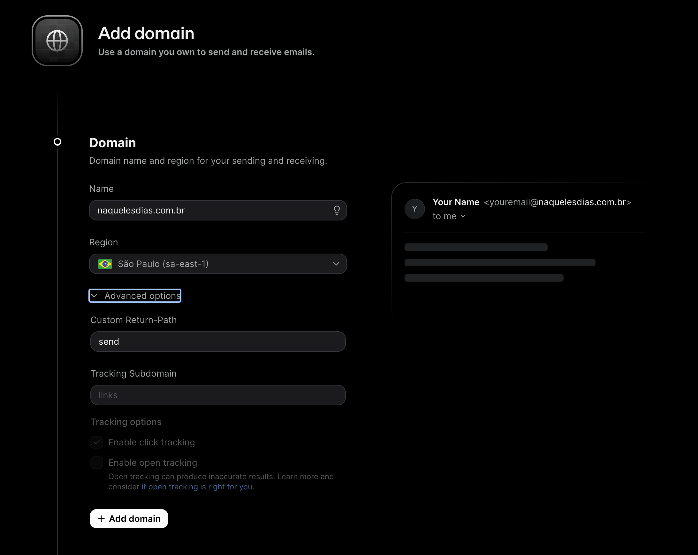
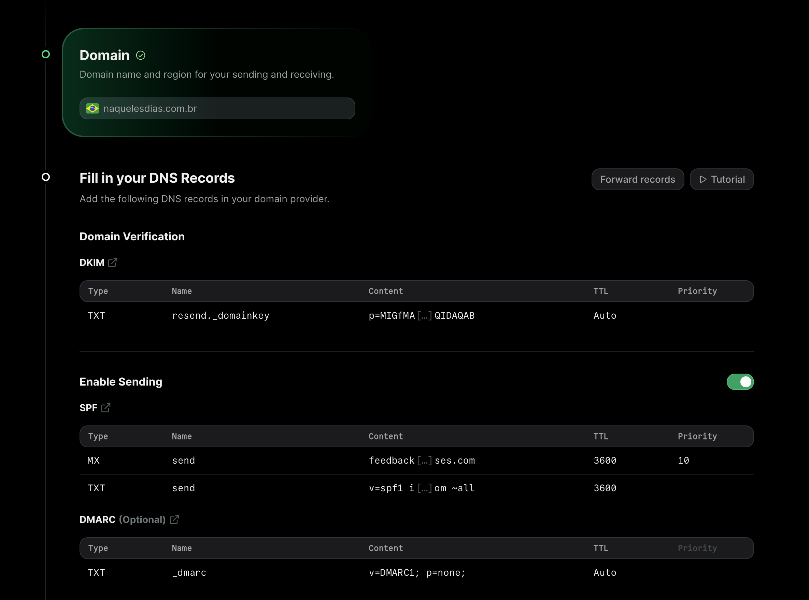
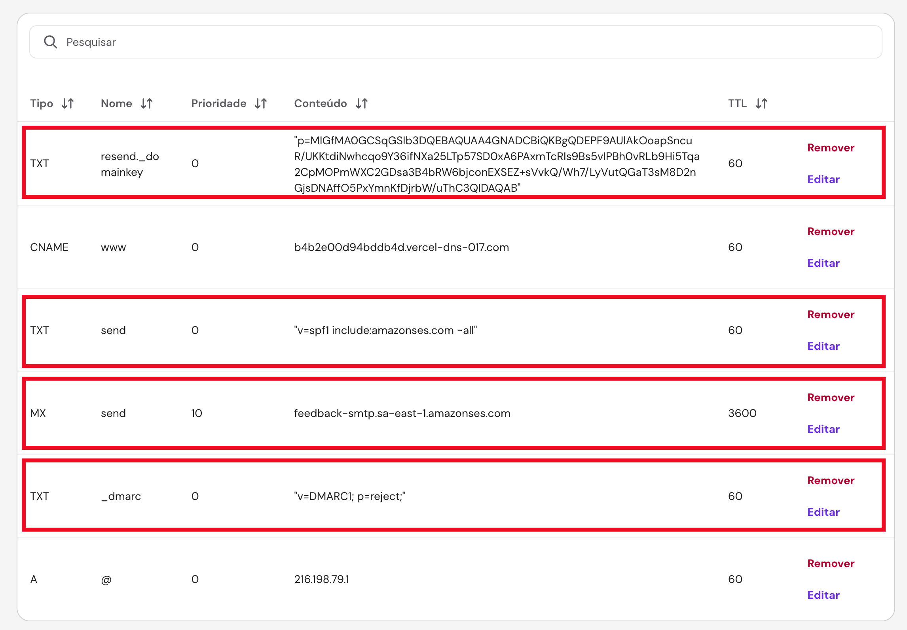
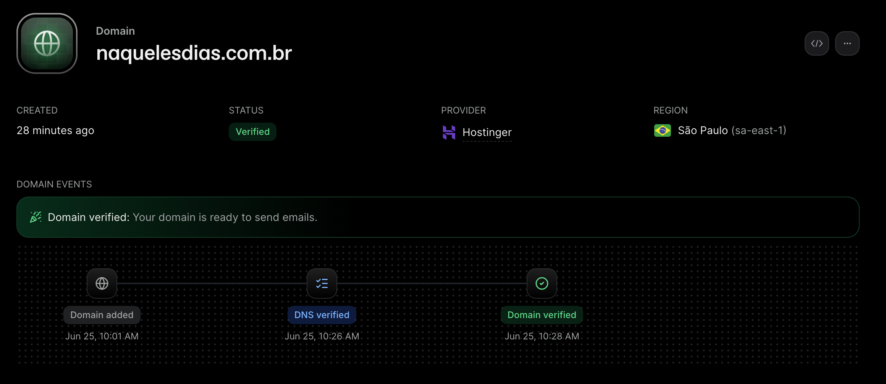
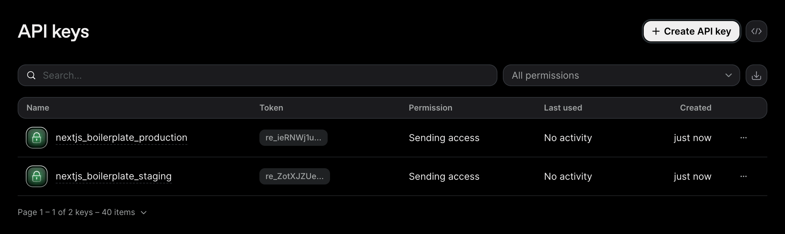
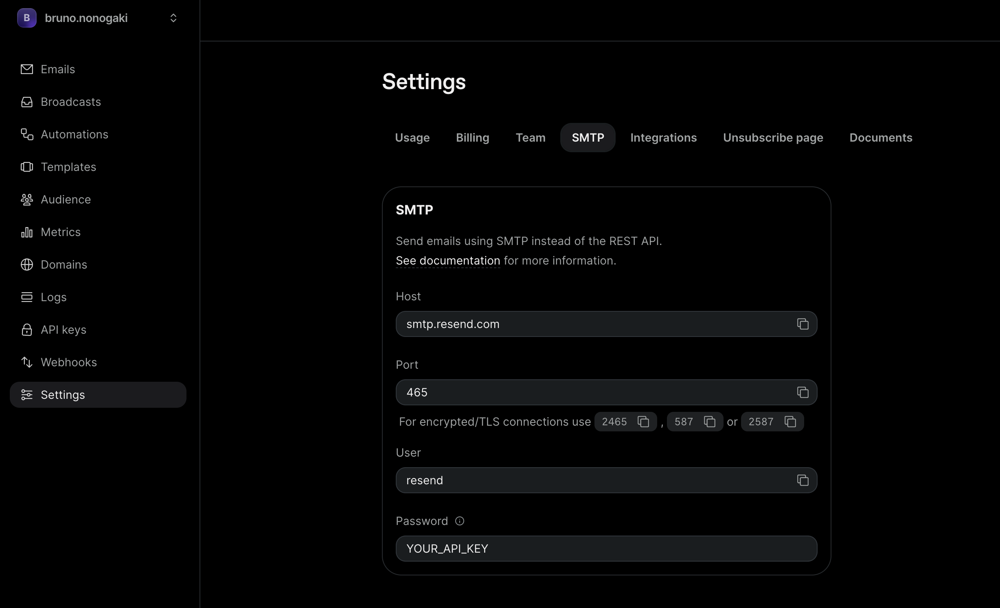
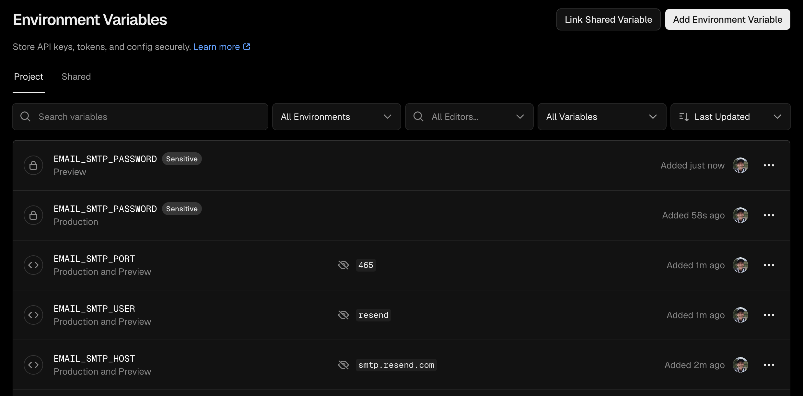
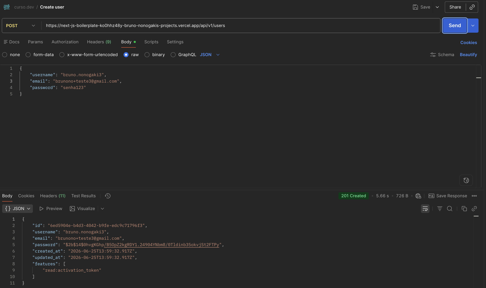

# Integrando serviço de e-mail (Resend)

Agora vamos integrar o nosso sistema de envio de e-mails com um serviço real. Para isso, vamos utilizar a plataforma da Resend. Então para começar, vamos criar uma conta lá no resend.com e configurar um novo domínio.

## Configurando domínio na Resend



Uma vez adicionado o domínio, a Resend já vai gerar os registros DNS que teremos que criar:



## Criando os registros DNS

Agora vamos criar os registros TXT para DKIM, SPF e DMARC, além do registro MX. Resumidamente:

- SPF: lista os servidores autorizados a enviar e-mails em nome do seu domínio.
- DKIM: fornece uma chave pública usada para verificar que o conteúdo do e-mail não foi alterado durante o envio.
- DMARC: define a política a ser aplicada quando há discrepância entre os domínios usados no cabeçalho (por exemplo, `MAIL_FROM`) e o domínio do remetente, informando como tratar mensagens suspeitas (nenhuma ação, quarentena ou rejeição). Nesse caso, vamos configurar a politica "reject".
- MX: indica qual servidor é responsável por receber e-mails para o domínio.

Mas recomendo assistir à aula no Curso, que está sensacional!

De qualquer forma, vamos criar esses registros no nosso provedor de DNS:



E para validar se o registro foi criado com sucesso, podemos fazer um teste com o dig:

```
dig send.naquelesdias.com.br TXT

; <<>> DiG 9.10.6 <<>> send.naquelesdias.com.br TXT
;; global options: +cmd
;; Got answer:
;; ->>HEADER<<- opcode: QUERY, status: NOERROR, id: 27531
;; flags: qr rd ra; QUERY: 1, ANSWER: 1, AUTHORITY: 0, ADDITIONAL: 0

;; QUESTION SECTION:
;send.naquelesdias.com.br.	IN	TXT

;; ANSWER SECTION:
send.naquelesdias.com.br. 60	IN	TXT	"v=spf1 include:amazonses.com ~all"

;; Query time: 753 msec
;; SERVER: 100.64.0.2#53(100.64.0.2)
;; WHEN: Thu Jun 25 10:12:53 -03 2026
;; MSG SIZE  rcvd: 88
```

Pronto, agora vamos voltar pra Resend e confirmar se os registros estão corretos:



## Criando as chaves de API

Agora vamos criar as chaves de API e configurar os secrets no nosso ambiente da Vercel.

Então no Resend, crie uma nova chave de API para Staging e outra para Production. Copie as chaves porque ela não serão mais exibidas no futuro.



E agora vamos adicionar as variáveis de ambiente na Vercel. Na interface da Reset, em Settings -> SMTP, é possível pegar quais são esses valores (exceto a API Key)



E na Vercel vai ficar assim:



## Testando

Agora podemos testar a criação de um novo usuário via API (Postman), e confirmar que o e-mail vai chegar na sua caixa:


!!! success

    Sucesso! Nosso app já está enviando e-mails de verdade!
